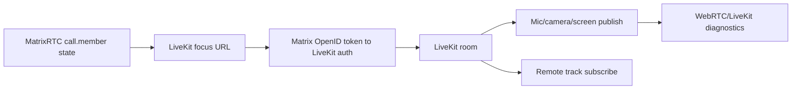

# Streaming Pipeline

Owner: DOCUMENTATION for structure; runtime owners by subsystem
Last reviewed: 2026-06-16 by DOCUMENTATION

## Status

Stable architecture map for current call, MatrixRTC, LiveKit, and desktop media
boundaries. Detailed tuning history belongs in the related investigation docs.

## Purpose

Use this map when changing calls, screen sharing, shared-content audio,
LiveKit, MatrixRTC membership, direct Matrix calls, RNNoise capture behavior,
or WebRTC diagnostics.

## Scope

In scope:
- runtime call and streaming paths
- MatrixRTC and LiveKit coordination
- Flutter/native/plugin ownership boundaries
- safe modification rules for media behavior

Not in scope:
- historical tuning experiments
- release-test matrices
- one-off diagnostic transcripts

## Standard Terms

- **MatrixRTC**: Matrix room state that advertises active call membership and
  focus metadata.
- **LiveKit room**: the SFU-backed group-call room used for group media.
- **Direct Matrix call**: the separate one-to-one Matrix SDK call path.
- **Shared-content audio**: non-microphone audio captured from shared desktop
  content when platform support exists.
- **RNNoise path**: the microphone noise-suppression pipeline that should stay
  separate from shared-content audio.

## Diagram Style

Use left-to-right Mermaid flowcharts with short labels. Reserve platform or
protocol names for boundaries where they matter operationally.

## Pipelines

### LiveKit Group Calls

### Direct Matrix Calls

## Dependency Map

| Area | Primary paths | Key dependencies |
| --- | --- | --- |
| MatrixRTC room component | `lib/client/matrix/components/voip_room/matrix_voip_room_component.dart` | `org.matrix.msc3401.call.member`, focus state |
| LiveKit auth/connect | `matrix_livekit_backend.dart` | `.well-known`, OpenID token, LiveKit auth service |
| LiveKit session | `matrix_livekit_voip_session.dart` | LiveKit room, WebRTC stats, preferences |
| Direct calls | `lib/client/matrix/components/voip/matrix_voip_session.dart` | Matrix SDK call session |
| Stream profiles | `lib/client/components/voip/screen_share_quality_profile.dart` | user prefs, codec/simulcast settings |
| Adaptive fallback | `screen_share_adaptive_fallback.dart` | diagnostics snapshots |
| Shared audio | `lib/client/components/voip/share_session/`, `plugins/intergalactic_windows_share/` | Windows capture plugin |
| RNNoise | `lib/client/components/voip/audio/noise_suppression/`, `plugins/intergalactic_noise_suppression/` | Flutter WebRTC capture hook |
| Diagnostics | `voip_call_diagnostics.dart`, Developer Logs | WebRTC stats, redacted logs |

## Flutter And Native Boundaries

- Flutter/Dart owns call state orchestration, preferences, MatrixRTC state,
  LiveKit publish options, receiver priority, and diagnostics formatting.
- LiveKit owns SFU transport and track publication/subscription.
- Flutter WebRTC owns media capture and WebRTC stats surfaces.
- Native plugins own Windows RNNoise capture hooks and Windows shared-content
  audio. These must fail open: calls and screen video continue if a plugin is
  unavailable.
- Platform capture paths differ: desktop uses Flutter WebRTC source selection,
  Android uses Android screen capture, iOS uses ReplayKit activation for
  supported paths.

## Matrix And LiveKit Interaction

- MatrixRTC room state advertises membership, expiry, client metadata, and
  LiveKit focus information.
- The client obtains a Matrix OpenID token and sends it to the LiveKit auth
  service with Inter Galactic client metadata when supported.
- LiveKit is the media plane for group calls; Matrix remains the room,
  membership, and auth coordination plane.
- Direct one-to-one Matrix calls are intentionally separate from LiveKit and
  should not be migrated as part of stream tuning.

## WebRTC Media Flow

1. Select capture source and optional shared-audio mode.
2. Resolve `ScreenShareProfileConfig` from normal profile or developer
   advanced override.
3. Create capture options and LiveKit publish options.
4. Publish video and, when supported, shared-content audio as separate tracks.
5. Apply RTP sender limits after publish as a second guardrail.
6. Use diagnostics to separate capture, encode, send, receive, decode, and ICE
   route failures.

## How To Modify Safely

1. Separate direct Matrix call bugs from LiveKit group-call bugs.
2. Do not retune bitrate/fallback before checking capture, encode, send,
   receive, and ICE diagnostics.
3. Keep RNNoise on microphone capture only; shared-content audio is not mic
   audio.
4. Keep shared-content audio fail-open so screen video can publish without it.
5. Keep MatrixRTC state expiry and cleanup behavior compatible with other
   MatrixRTC clients.
6. For Windows capture-size work, validate the visible remote frame, not only
   sender stats.
7. For core call/stream changes, update the relevant detailed streaming doc and
   call out release-validation risk in the pull request.

## Related Docs

- `README.md` owns folder routing and explains why each calls/streaming/audio
  doc remains separate.
- `livekit-gameplay-streaming.md` owns detailed streaming defaults and
  diagnostics history.
- `stream-optimization-report.md`, `stream-diagnostics-gaps.md`, and
  `streaming-guidance-status.md` own current investigation evidence.
- `../diagnostics/diagnostic-logging.md` owns stable-build file logging and the
  `--ig-webrtc-stats` runtime diagnostics flag.
- `windows-share-session.md` owns shared-content audio details.
- `windows-libwebrtc-hardware-encoding.md` owns the native encoder fork path.
- `voip-soundboard.md` owns soundboard playback in calls.
