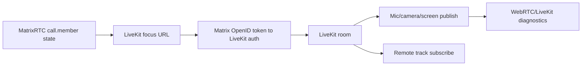
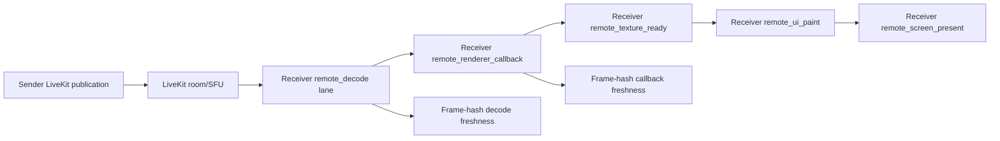
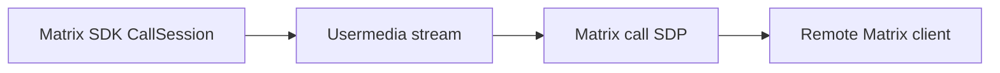

# Streaming Pipeline

Last reviewed: 2026-08-06

## Status

Stable architecture map for current call, MatrixRTC, LiveKit, desktop media,
gameplay sender, and true-receiver evidence boundaries. Detailed tuning
history belongs in the related investigation docs.

## Purpose

Use this map when changing calls, screen sharing, shared-content audio,
LiveKit, MatrixRTC membership, direct Matrix calls, RNNoise capture behavior,
or WebRTC diagnostics.

## Scope

In scope:
- runtime call and streaming paths
- MatrixRTC and LiveKit coordination
- Flutter/native/plugin ownership boundaries
- safe modification rules for media behavior

Not in scope:
- historical tuning experiments
- release-test matrices
- one-off diagnostic transcripts
- runtime tuning decisions that belong in `streaming-guidance-status.md`

## Standard Terms

- **MatrixRTC**: Matrix room state that advertises active call membership and
  focus metadata.
- **LiveKit room**: the SFU-backed group-call room used for group media.
- **Direct Matrix call**: the separate one-to-one Matrix SDK call path.
- **Shared-content audio**: non-microphone audio captured from shared desktop
  content when platform support exists.
- **RNNoise path**: the microphone noise-suppression pipeline that should stay
  separate from shared-content audio.
- **True receiver**: a separate subscriber path that receives the published
  LiveKit stream. It may run in-process for functional probes, but performance
  gates use the external receiver process.
- **Local preview/self-view**: the sender-side local publication preview. It is
  diagnostic only and cannot prove remote receive smoothness.
- **Frame-hash freshness**: a bounded native renderer tap that hashes sampled
  decoded/rendered frames in memory and reports unique-frame cadence without
  persisting raw frames.

## Diagram Style

Use left-to-right Mermaid flowcharts with short labels. Reserve platform or
protocol names for boundaries where they matter operationally.

## Pipelines

### LiveKit Group Calls

### Windows Gameplay Stream Sender

The current Windows high-motion gameplay path is still developer/experimental.
Normal screen and window sharing must continue to work through the established
desktop capture paths while the D3D11 game-hook path is validated.

Stable boundaries:
- GPU/native NV12 is the intended product direction for BG3-class gameplay,
  with CPU I420/readback retained as fallback and diagnostic contrast.
- The sender path must be judged by capture, encode, send, p95/max gaps,
  native readiness, live `OnFrame`, Media Foundation handoff, and visual
  freshness evidence. Average FPS alone is not enough.
- Recent receiver-probe work shows source/game motion can be smooth while the
  stream cadence still fails. Do not route a stutter report to receiver,
  bitrate, LiveKit/SFU, or server tuning until same-run sender cadence and
  receiver inbound/decode/render evidence identify that boundary.

### True Receiver Evidence

Receiver proof lanes:
- `local_preview`: sender-side local preview. Diagnostic only.
- `remote_decode`: true receiver decoded-frame freshness. Valid for decode-only
  gates when `freshness_source=frame_hash_tap`.
- `remote_renderer_callback`: true receiver renderer-callback freshness. Valid
  only as callback proof, with renderer attached/visible and
  `freshness_source=frame_hash_tap`.
- `remote_texture_ready`: receiver texture-update evidence after the renderer
  callback.
- `remote_ui_paint`: Flutter-side paint evidence for the receiver texture.
- `remote_screen_present`: screen-capture evidence of visible receiver
  presentation.

The external receiver runtime launches as `InterGalactic.exe --receiver-probe`.
It receives the subscribe-only LiveKit credential envelope through protected
local IPC, keeps tokens off command-line arguments and persistent artifacts,
publishes nothing, subscribes only to the selected screen-share publication,
and writes redacted receiver events/artifacts.

Current BG3 evidence makes the receiver failure real but not receiver-only:
the monitor-isolated external receiver render run was attached, visible, and
frame-hash based, but receiver decode and render unique FPS matched while
sender capture/encode/send were also below target. The next implementation
boundary is correlation/reporting that separates sender delivery, receiver
inbound, receiver decode, receiver render, and stale-content lineage.

### Direct Matrix Calls

## Dependency Map

| Area | Primary paths | Key dependencies |
| --- | --- | --- |
| MatrixRTC room component | `lib/client/matrix/components/voip_room/matrix_voip_room_component.dart` | `org.matrix.msc3401.call.member`, focus state |
| LiveKit auth/connect | `matrix_livekit_backend.dart` | `.well-known`, OpenID token, LiveKit auth service |
| LiveKit session | `matrix_livekit_voip_session.dart` | LiveKit room, WebRTC stats, preferences |
| Direct calls | `lib/client/matrix/components/voip/matrix_voip_session.dart` | Matrix SDK call session |
| Stream profiles | `lib/client/components/voip/screen_share_quality_profile.dart` | user prefs, codec/simulcast settings |
| Adaptive fallback | `screen_share_adaptive_fallback.dart` | diagnostics snapshots |
| Stream-test orchestration | `lib/client/components/voip/stream_test_runner.dart` plus same-library `stream_test_runner_*.dart` parts | runner orchestration, receiver summaries, reporting, scoring, native diagnostics, coverage |
| Receiver probe | `matrix_livekit_receiver_probe.dart`, `external_livekit_receiver_probe_runtime*.dart` | subscribe-only LiveKit receiver, protected IPC, frame-hash freshness |
| Shared audio | `lib/client/components/voip/share_session/`, `plugins/intergalactic_windows_share/` | Windows capture plugin |
| RNNoise | `lib/client/components/voip/audio/noise_suppression/`, `plugins/intergalactic_noise_suppression/` | Flutter WebRTC capture hook |
| Diagnostics | `voip_call_diagnostics.dart`, Developer Logs, stream-test reports | WebRTC stats, receiver probe events, redacted native markers |

## Flutter And Native Boundaries

- Flutter/Dart owns call state orchestration, preferences, MatrixRTC state,
  LiveKit publish options, receiver priority, and diagnostics formatting.
- LiveKit owns SFU transport and track publication/subscription.
- Flutter WebRTC owns media capture and WebRTC stats surfaces.
- Native plugins own Windows RNNoise capture hooks and Windows shared-content
  audio. These must fail open: calls and screen video continue if a plugin is
  unavailable.
- Windows gameplay capture can use the experimental D3D11 game-hook helper,
  shared textures, GPU scale/convert, and native NV12/WebRTC sender handoff.
  This path is experimental and should stay separate from normal
  WGC/window-GDI compatibility work.
- The external receiver probe is a diagnostic runtime. It is authoritative for
  receiver freshness only when it is external or otherwise explicitly
  identified, subscribed to the intended publication, and reporting valid
  decode/render frame-hash lanes.
- Platform capture paths differ: desktop uses Flutter WebRTC source selection,
  Android uses Android screen capture, iOS uses ReplayKit activation for
  supported paths.

## Matrix And LiveKit Interaction

- MatrixRTC room state advertises membership, expiry, client metadata, and
  LiveKit focus information.
- The client obtains a Matrix OpenID token and sends it to the LiveKit auth
  service with Inter Galactic client metadata when supported.
- LiveKit is the media plane for group calls; Matrix remains the room,
  membership, and auth coordination plane.
- Direct one-to-one Matrix calls are intentionally separate from LiveKit and
  should not be migrated as part of stream tuning.

## WebRTC Media Flow

1. Select capture source and optional shared-audio mode.
2. Resolve `ScreenShareProfileConfig` from normal profile or developer
   advanced override.
3. Create capture options and LiveKit publish options.
4. Publish video and, when supported, shared-content audio as separate tracks.
5. Apply RTP sender limits after publish as a second guardrail.
6. Use diagnostics to separate capture, encode, send, receive, decode, and ICE
   route failures.

## Diagnostic Evidence Rules

- Self-view, local preview, and hidden remote tiles are diagnostic only. They
  cannot pass true-receiver visual freshness gates.
- True receiver callback proof requires `remote_renderer_callback`,
  `freshness_source=frame_hash_tap`, `renderer_attached=true`, and
  `renderer_visible=true`; it does not by itself prove screen presentation.
- True receiver presentation proof requires the appropriate
  `remote_texture_ready`, `remote_ui_paint`, or `remote_screen_present` stage
  for the claim being made.
- Decode-only proof requires `remote_decode` with
  `freshness_source=frame_hash_tap`; it does not prove the visible render path.
- BG3/gameplay pass claims must preserve source motion while the receiver
  probe is active. Receiver probe windows should be monitor-isolated when
  visible so they do not steal focus and invalidate the source motion.
- Sender context must be included with receiver context. A receiver failure
  with low sender send cadence is a sender/delivery correlation problem, not a
  pure receiver renderer diagnosis.
- Report/classifier changes must update stream-test JSON, Markdown, diagnostic
  coverage, and bottleneck labels together.

## How To Modify Safely

1. Separate direct Matrix call bugs from LiveKit group-call bugs.
2. Do not retune bitrate/fallback before checking capture, encode, send,
   receive, decode/render, visual freshness, and ICE diagnostics.
3. Keep RNNoise on microphone capture only; shared-content audio is not mic
   audio.
4. Keep shared-content audio fail-open so screen video can publish without it.
5. Keep MatrixRTC state expiry and cleanup behavior compatible with other
   MatrixRTC clients.
6. For Windows capture-size, game-hook, or sender-handoff work, validate
   visible remote freshness and receiver evidence, not only sender stats.
7. Keep receiver, LiveKit/SFU, server, bitrate, and quality-policy changes
   behind evidence that sender cadence is healthy and the first failing
   boundary is actually downstream.
8. For core call/stream changes, update the relevant detailed streaming doc and
   call out release-validation risk in the pull request.

## Related Docs

- `README.md` owns folder routing and explains why each calls/streaming/audio
  doc remains separate.
- `livekit-gameplay-streaming.md` owns detailed streaming defaults and
  diagnostics history.
- `stream-optimization-report.md` and `streaming-guidance-status.md` own
  current investigation evidence.
- `stream-diagnostic-contract.md` and
  `stream-bottleneck-classification.md` own the current stream-test schema and
  interpretation rules.
- `../diagnostics/diagnostic-logging.md` owns stable-build file logging and the
  `--ig-webrtc-stats` runtime diagnostics flag.
- `windows-share-session.md` owns shared-content audio details.
- `windows-libwebrtc-hardware-encoding.md` owns the native encoder fork path.
- `voip-soundboard.md` owns soundboard playback in calls.
