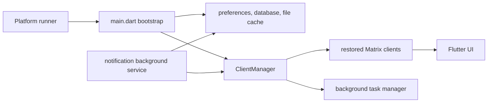

# Client Lifecycle And Background Runtime

## Purpose

This page maps the long-lived app lifecycle boundaries that are shared by
startup, account restoration, background notification handling, temporary file
storage, and user-visible background work. It is intended to help contributors
choose the correct layer without moving Matrix rules into widgets or treating a
background service as a second foreground app.

## Runtime Boundary

The foreground bootstrap owns global initialization. It creates the file cache,
restores the `ClientManager`, then starts global services such as notifications
and session-lifecycle watching. UI code consumes manager state and events; it
does not create competing Matrix clients for ordinary screen interactions.

## ClientManager

`ClientManager` is the foreground owner of restored clients and their shared
room/space collections. `ClientManager.init()` delegates persisted-account
restoration to `MatrixClient.loadFromDB()`.

When a client is added, the manager subscribes to its sync, self, room, space,
and connection-status streams. It reflects those updates through manager-level
collections and streams used by the rest of the app. Replacing a client with the
same identifier first detaches the old instance, so only one live client remains
attached to a Matrix session.

Logout and local disposal remove subscriptions, rooms, spaces, and identity-map
entries before closing the client.

`ClientManager.close()` is the teardown contract: it closes direct-message and
call coordination, cancels remaining client and space subscriptions, then
closes every managed client. It is idempotent. Note that this is a contract on
the method, not a description of process exit - nothing on the normal
application shutdown path calls it today; the only caller is the onboarding
tutorial demo tearing down its throwaway manager
(`intergalactic/lib/ui/onboarding/tutorial_demo_backdrop.dart`). Anything that
must run before the process goes away needs either an explicit shutdown hook
that calls this or its own platform lifecycle handling.

## Background Work And Notifications

The app-wide `BackgroundTaskManager` represents user-visible, finite work such
as a connection-status problem or a media import. Producers add tasks to the
shared manager; the background-task UI observes that manager rather than owning
those operations.

Platform notification work is separate. `BackgroundNotificationsManager` runs
in a headless service when the platform starts it. It marks the process
headless, initializes the notification stack and file cache when needed, and
restores a `ClientManager` with `isBackgroundService: true`. It processes queued
notification room/event references only when the restored client exposes the
room and event. The service stops after its queue drains.

Dequeue is not at-least-once. Both service implementations remove the entry
from the queue *before* awaiting `handleMessage`, so an entry whose room or
event is not available on the restored client - or whose handling throws - is
already gone and is never retried; the failure is logged and the loop moves
on. Restoration being awaited guarantees a client, not room or event
availability. Treat a queued notification as best-effort. Anything that must
survive a transient miss needs the entry retained until handling succeeds, or
persisted and retried.

Do not use this path for normal foreground navigation, and do not assume a
background service has the same UI or lifecycle guarantees as the foreground
app.

## Database Release Across Suspension

iOS terminates a suspended process that still holds a lock on a file in a
shared container (`0xdead10cc`). SQLite locks in rollback-journal mode are
transaction-scoped, so the exposure is suspending mid-transaction, and the
Matrix SDK holds one transaction across all of sync processing. The B5
mechanism (`fix/db-re-establish`, 0.8.2) has three parts, in three files:

- `ReleasableConnection` (`utils/database/releasable_connection.dart`) is the
  one connection object the SDK holds for the life of a client. Its inner
  executor can be released and rebuilt; the SDK never learns of either. Every
  open wrapper registers itself in `ReleasableConnection.live`, which is what
  the trigger sweeps. `release()` refuses while anything is in flight;
  `reestablish()` reports `established`, `deferred` or `failed`, and
  `deferred` is a normal state (the file is unreadable between a reboot and
  the first unlock).
- `DatabaseReleaseTrigger` (`utils/database/database_release_trigger.dart`) is
  the lifecycle observer. On `paused` it checks for live background execution
  (any call session), takes a background assertion, stops every Matrix
  client's sync loop - `abortSync` waits for the transaction sync holds - then
  polls each wrapper for quiescence and releases it, within a bounded window.
  On `resumed` it re-establishes every released wrapper and only then
  restarts sync; a `deferred` result leaves sync stopped and retries on the
  next resume. Pure Dart, no platform conditionals.
- `BackgroundAssertion` (`utils/background_assertion.dart`) is the bounded
  "keep me running" primitive, backed on iOS by the `background_assertion`
  channel into one registry in `AppDelegate.swift`; the notification-response
  path (BUG-295) is the other consumer of that registry. Every other platform
  has no host and the sweep simply runs without one.

The trigger is attached on iOS only, and that is a decision rather than a
side effect. The mechanism has no platform conditional; `main.dart` does. The
reason for the mechanism is iOS-specific (`0xdead10cc`, and a process frozen
shortly after `paused`), while on Android `paused` fires on every app switch
with the process still running - so attaching it there would stop foreground
sync and drop the database on every backgrounding, a cost for a failure
Android does not have. Desktop never reports `paused` (dart:ui documents it
as iOS and Android only; minimise yields `hidden`, which the trigger
ignores). Extending to Android needs its own reason and its own QA, not a
removed `if`. `DatabaseIsolate.releaseAll()` is test-only surface: the
trigger sweeps the wrappers, never the isolate directly.

Two invariants to keep:

- Release only when there is no in-flight transaction and no live background
  execution. It is one condition, consulted by the trigger and enforced by the
  wrapper; never design a second one.
- Every request that reaches the drift server for a tracked database goes
  through the wrapper's counters, including late ones. drift resolves its
  engine from the zone, so a future spawned inside a `transaction()` block
  and outliving it still targets that transaction's executor, and drift
  only asserts against that in debug builds. Such a request waits at the
  server for a dead executor's turn forever, uncounted, and a release then
  kills it with `Bad state: No element` (the B5 release-instant
  observation, BUG-318). The counted transaction and exclusive wrappers
  therefore run work that arrives after they completed on the root
  connection instead - counted - and log it with a stack under
  `stale_transaction_uses` so the leaking caller can be named from a
  capture. Reads run on the root after any end. Writes and nested blocks
  run on it only after a COMMIT, where the parent the caller wanted to join
  has landed; after a rollback they throw, because a late write on the root
  would silently and durably commit what the rollback discarded. A local
  throw reaches the server not at all, so the contract holds either way. A
  released root still throws; this is not a lazy reconnect.
- Sync does not restart until every released database is `established`. A
  query against a released wrapper throws `StateError` by design, so a
  premature restart fails loudly at the first query rather than silently.

Sync is not the only writer, and the device proof showed the others. Two
rules for anything that touches the database from a lifecycle hook or a
timer:

- A lifecycle writer that fires on `resumed` awaits
  `DatabaseReleaseTrigger.instance?.whenEstablished` before it touches the
  database. The gate is armed by the trigger at release time and completes
  after every released database is established and sync has restarted; it is
  already complete when nothing was released. This is deliberately not
  "ask the wrapper whether a re-establish is pending": at wake the writer's
  observer runs before the trigger's (its listener registers during client
  load, the trigger attaches after), and the trigger's resume is serialised a
  microtask later regardless, so the wrapper has nothing pending to report
  and the write meets the `StateError`. The wrapper's own wait
  (`_liveOrPending`) only covers a caller that lands mid-swap. Synchronous
  factories cannot wait and still throw. A `failed` re-establish completes
  the gate with a `StateError` and re-arms it for the retry, so a waiting
  writer fails loudly in its own error path instead of hanging; a permanent
  failure is never a silent deferral at either layer. The presence watcher
  is the measured case; its tests issue the write first and let the trigger
  resume, and drop the write on a failed resume.
- Nothing may write between `paused` and `resumed`. There is no re-establish
  to wait for while the app is backgrounded-and-running, so a timer that
  fires there meets the `StateError`. Cancel such timers on `paused` - the
  presence watcher's inactivity timer is the measured case - rather than
  teaching the wrapper to defer work, which would be the lazy reconnect the
  design rejected.
- The rule binds timers that READ as much as timers that write, and a
  reader that cannot be cancelled waits instead. The last-seen cache's
  cleaner (`InMemoryCache`, 100 s poll) removed an entry two seconds before
  `event=resumed` on the phone, and `onLastSeenRemoved`'s presence read met
  the `StateError` as an unhandled zone error. Such a reader calls
  `DatabaseReleaseTrigger.waitForDatabase(source)` first: true when
  established or nothing was released, false (logged) when the re-establish
  failed, so the caller returns. Deferring a presence refresh until resume
  costs nothing; this is the caller opting in, not the wrapper deferring
  for everyone. Consumer-driven reads that can run at wake
  (`getUserPresence`) take the same gate.
- **And it binds WRITES, and callers that are not timers at all.** Two more
  sites were found on device after the read gate merged, both throwing the
  same `StateError`. `_rememberPresence`'s `storePresence` is reached from
  the inactivity timer on wake and while backgrounded-but-running; it gates
  the PERSIST only, because that row is a cache of a value the server already
  has, while failing the whole call would discard a presence change the user
  made. `respondToRoomKeyRequest` is driven by a peer's inbound key request
  rather than by any local timer, and it refuses when the gate fails so the
  requester retries - 76 occurrences in each of two phone logs on builds
  predating the release trigger, which only raised the frequency.
- The generalisation worth keeping: the question is not "is this a timer" or
  "is this a read", it is whether the caller can run before the trigger's
  resume. Anything that can takes the gate, and chooses for itself whether a
  failed gate means skip, defer or refuse.

The residual - a transaction that outlives the window, so the process
suspends holding a lock - is counted, not assumed rare: `timed_out` in the
aggregate `database_release counters` log line the trigger writes after each
sweep. The counters are fixed-key, saturating, and carry no identifier, path
or timestamp.

## Account Database Location On iOS

On iOS the Matrix account databases live in the App Group container
(`group.chat.intergalactic.app`, under `db/account/drift/<clientName>/`),
not in the app-private Application Support tree, so a Notification Service
Extension can read them (NSE Phase B, 0.8.2). Every other platform keeps
`<Application Support>/db/account/drift`, byte for byte.

The move is owned by three pieces under
`lib/client/matrix/database/app_group/`:

- `DriftDatabaseLocation.prepare()` runs from `initNecessary` **before**
  `ClientManager.init`, so it runs once per launch, before any client opens a
  database, and covers every account directory on disk - it enumerates the
  source directory, never the registered-clients preference (a directory whose
  preference entry was lost would otherwise be stranded). When the App Group
  path is authoritative for the launch it publishes the root that
  `AppConfig.getDriftDatabasePath` returns. A dev-profile override
  (`INTERGALACTIC_DEV_PROFILE_DIR`) wins outright and nothing moves.
- `DriftAppGroupMigration` does the move under the applicable security and
  compliance requirements. The data-protection class
  `completeUntilFirstUserAuthentication` is set on the directories before any
  file lands in them, then on every moved file, read back each time, and
  re-asserted over the whole tree on every launch; if it cannot be set before
  the first move, nothing moves and the app-private path stays authoritative.
  The journal-family files move before `data.db` - a database without its hot
  journal reads as consistent when it is not. A marker beside the tree
  (`db/account/.drift-app-group-migration.json`, stage and version only)
  is written before the first move, so an interrupted move is resumed on the
  next launch rather than re-decided; a source whose destination already
  holds a database is moved to `db/account/drift-quarantine/` in the
  app-private container, never overwritten or discarded, and reported on
  every launch until someone acts on it.
- `AppGroupStorageHost` is the native bridge (`app_group_storage` channel in
  `AppDelegate.swift`): container path, protect-and-read-back, and a
  read-only class query. The native side accepts no path outside the App
  Group container for writes.

The app-private copy is deleted on the launch **after** the one that first
read from the new location, and the deletion is verified. Diagnostics carry a
stage, counts and an error class or errno; no path, account name, listing or
contents, on either side of the channel.

Two consequences to keep in view:

- The file is unreadable between a reboot and the first unlock. That is why
  `ReleasableConnection.reestablish()` has a `deferred` result, and why the
  release trigger above leaves sync stopped and retries on the next resume.
- App Groups have no intra-group access control. Every target in the group -
  Runner, the Share and Broadcast Extensions, and any future extension - can
  read the account database once it lives there. Adding a target to the group
  is a security decision (S&C standing rule), and no extension other than the
  Notification Service Extension may gain a read path to it.

On the iOS Simulator the protection class is not reported back by the
filesystem, so the migration declines and the app keeps the app-private path
there. The App Group location is exercised on device only.

## Cache Boundary

`FileCache` is an interface with a platform-aware implementation. On IO
platforms, `DriftFileCache` keeps cache metadata in an app database while files
live in the temporary-directory cache namespace.

Three conditions on that contract are easy to over-read:

- `getFile` refreshes `lastAccessedTimestamp`. `hasFile` does not, so an
  existence probe does not renew an entry.
- Entries older than five days are *eligible* for cleanup. `init()` runs
  `clean()` only when the process is not headless, and does not await it, so
  cleanup is opportunistic rather than guaranteed to have run before the first
  read.
- A missing file makes `hasFile` report a miss and attempt to delete the stale
  row. That delete is best-effort: a failure is logged and the row is retained,
  so a row can outlive its file.

The foreground bootstrap initializes the cache before account restoration. The
notification service initializes it only if that process has not already done
so. Callers should use the `FileCache` interface and must not rely on a
particular temporary path or cache persistence beyond the API contract.

## Important Paths

- `intergalactic/lib/main.dart` — foreground bootstrap and shared runtime
  singletons.
- `intergalactic/lib/client/client_manager.dart` — restored-client ownership,
  aggregation, and teardown.
- `intergalactic/lib/client/matrix/matrix_client.dart` — persisted Matrix client
  restoration.
- `intergalactic/lib/service/background_service_notifications/background_service_task_notification.dart`
  and
  `intergalactic/lib/service/background_service_notifications/background_service_task_notification2.dart`
  — headless notification lifecycle; there are two implementations and both are
  live.
- `intergalactic/lib/utils/background_tasks/background_task_manager.dart` —
  user-visible background-task registry.
- `intergalactic/lib/utils/database/releasable_connection.dart`,
  `intergalactic/lib/utils/database/database_release_trigger.dart`,
  `intergalactic/lib/utils/background_assertion.dart` — database release
  across suspension and the assertion it runs under.
- `intergalactic/lib/cache/file_cache.dart` and
  `intergalactic/lib/cache/drift_file_cache.dart` — cache contract and IO
  implementation.

## Change Guidance

- Preserve the single-owner rule for a restored Matrix client identifier.
- Keep Matrix/session rules in the client layer, not in UI listeners.
- Treat the background notification service as headless and bounded; do not add
  UI dependencies to it.
- Keep temporary-cache behavior behind `FileCache`; do not document or depend on
  workstation-specific cache locations.
- Changes to account restoration, background notification handling, or cache
  cleanup should update this map and receive the relevant Matrix, notification,
  and platform review.
