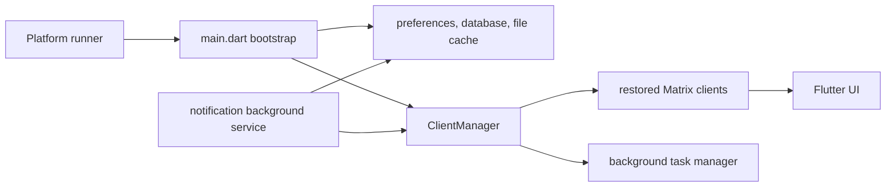

# Client Lifecycle And Background Runtime

## Purpose

This page maps the long-lived app lifecycle boundaries that are shared by
startup, account restoration, background notification handling, temporary file
storage, and user-visible background work. It is intended to help contributors
choose the correct layer without moving Matrix rules into widgets or treating a
background service as a second foreground app.

## Runtime Boundary

The foreground bootstrap owns global initialization. It creates the file cache,
restores the `ClientManager`, then starts global services such as notifications
and session-lifecycle watching. UI code consumes manager state and events; it
does not create competing Matrix clients for ordinary screen interactions.

## ClientManager

`ClientManager` is the foreground owner of restored clients and their shared
room/space collections. `ClientManager.init()` delegates persisted-account
restoration to `MatrixClient.loadFromDB()`.

When a client is added, the manager subscribes to its sync, self, room, space,
and connection-status streams. It reflects those updates through manager-level
collections and streams used by the rest of the app. Replacing a client with the
same identifier first detaches the old instance, so only one live client remains
attached to a Matrix session.

Logout and local disposal remove subscriptions, rooms, spaces, and identity-map
entries before closing the client.

`ClientManager.close()` is the teardown contract: it closes direct-message and
call coordination, cancels remaining client and space subscriptions, then
closes every managed client. It is idempotent. Note that this is a contract on
the method, not a description of process exit - nothing on the normal
application shutdown path calls it today; the only caller is the onboarding
tutorial demo tearing down its throwaway manager
(`intergalactic/lib/ui/onboarding/tutorial_demo_backdrop.dart`). Anything that
must run before the process goes away needs either an explicit shutdown hook
that calls this or its own platform lifecycle handling.

## Background Work And Notifications

The app-wide `BackgroundTaskManager` represents user-visible, finite work such
as a connection-status problem or a media import. Producers add tasks to the
shared manager; the background-task UI observes that manager rather than owning
those operations.

Platform notification work is separate. `BackgroundNotificationsManager` runs
in a headless service when the platform starts it. It marks the process
headless, initializes the notification stack and file cache when needed, and
restores a `ClientManager` with `isBackgroundService: true`. It processes queued
notification room/event references only when the restored client exposes the
room and event. The service stops after its queue drains.

Dequeue is not at-least-once. Both service implementations remove the entry
from the queue *before* awaiting `handleMessage`, so an entry whose room or
event is not available on the restored client - or whose handling throws - is
already gone and is never retried; the failure is logged and the loop moves
on. Restoration being awaited guarantees a client, not room or event
availability. Treat a queued notification as best-effort. Anything that must
survive a transient miss needs the entry retained until handling succeeds, or
persisted and retried.

Do not use this path for normal foreground navigation, and do not assume a
background service has the same UI or lifecycle guarantees as the foreground
app.

## Cache Boundary

`FileCache` is an interface with a platform-aware implementation. On IO
platforms, `DriftFileCache` keeps cache metadata in an app database while files
live in the temporary-directory cache namespace.

Three conditions on that contract are easy to over-read:

- `getFile` refreshes `lastAccessedTimestamp`. `hasFile` does not, so an
  existence probe does not renew an entry.
- Entries older than five days are *eligible* for cleanup. `init()` runs
  `clean()` only when the process is not headless, and does not await it, so
  cleanup is opportunistic rather than guaranteed to have run before the first
  read.
- A missing file makes `hasFile` report a miss and attempt to delete the stale
  row. That delete is best-effort: a failure is logged and the row is retained,
  so a row can outlive its file.

The foreground bootstrap initializes the cache before account restoration. The
notification service initializes it only if that process has not already done
so. Callers should use the `FileCache` interface and must not rely on a
particular temporary path or cache persistence beyond the API contract.

## Important Paths

- `intergalactic/lib/main.dart` — foreground bootstrap and shared runtime
  singletons.
- `intergalactic/lib/client/client_manager.dart` — restored-client ownership,
  aggregation, and teardown.
- `intergalactic/lib/client/matrix/matrix_client.dart` — persisted Matrix client
  restoration.
- `intergalactic/lib/service/background_service_notifications/background_service_task_notification.dart`
  and
  `intergalactic/lib/service/background_service_notifications/background_service_task_notification2.dart`
  — headless notification lifecycle; there are two implementations and both are
  live.
- `intergalactic/lib/utils/background_tasks/background_task_manager.dart` —
  user-visible background-task registry.
- `intergalactic/lib/cache/file_cache.dart` and
  `intergalactic/lib/cache/drift_file_cache.dart` — cache contract and IO
  implementation.

## Change Guidance

- Preserve the single-owner rule for a restored Matrix client identifier.
- Keep Matrix/session rules in the client layer, not in UI listeners.
- Treat the background notification service as headless and bounded; do not add
  UI dependencies to it.
- Keep temporary-cache behavior behind `FileCache`; do not document or depend on
  workstation-specific cache locations.
- Changes to account restoration, background notification handling, or cache
  cleanup should update this map and receive the relevant Matrix, notification,
  and platform review.
