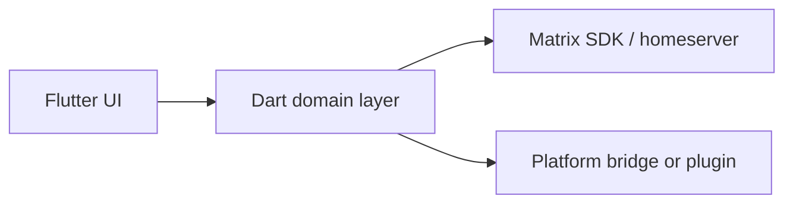
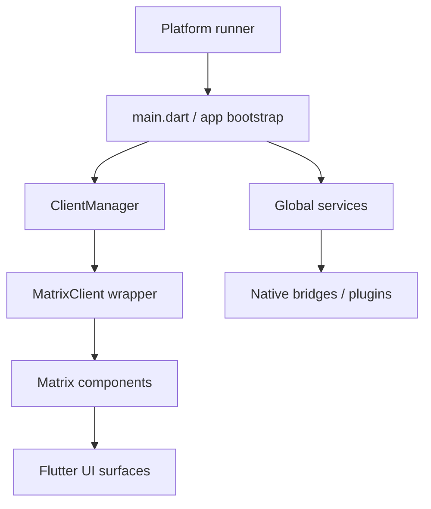

# System Overview

## Status

Stable contributor reference. Update this page when long-lived ownership or
cross-layer runtime boundaries change.

## Purpose

This is the high-level architecture map for Inter Galactic. Use it before
changing shared behavior so you can locate the owning layer, adjacent docs, and
the safest validation path.

## Scope

In scope:
- shared runtime layers
- ownership boundaries between Flutter, native runners, plugins, and protocol
  logic
- contributor-safe routing to more detailed architecture docs

Not in scope:
- feature-specific implementation detail
- release-only operator workflow
- temporary investigations or debug transcripts

## Standard Terms

- **Matrix client**: the app-facing wrapper around the Matrix SDK client.
- **Matrix room**: a Matrix room wrapper used by UI/domain components.
- **MatrixRTC**: Matrix room state that advertises call membership and LiveKit
  focus information.
- **LiveKit room**: the SFU-backed media room joined after MatrixRTC auth.
- **Direct Matrix call**: one-to-one Matrix SDK call path, separate from
  LiveKit group calls.
- **Pusher**: Matrix push registration for a device token, ntfy topic, or web
  subscription.
- **Platform bridge**: native runner or plugin code behind a Dart-facing API.

## Diagram Style

Architecture docs should use left-to-right Mermaid flowcharts for runtime
pipelines and short node labels. Put protocol or platform names in the label
when the boundary matters.

## Runtime Layers

## Dependency Map

| Layer | Primary paths | Depends on | Must not own |
| --- | --- | --- | --- |
| Bootstrap | `intergalactic/lib/main.dart` | config, preferences, services | protocol rules |
| Client lifecycle | `intergalactic/lib/client/client_manager.dart`, `matrix_client.dart` | Matrix SDK, storage, components | widget layout |
| Matrix components | `intergalactic/lib/client/matrix/components/` | Matrix client/room wrappers | native platform policy |
| UI | `intergalactic/lib/ui/` | domain interfaces, preferences | Matrix wire contracts |
| Platform runners | `intergalactic/android/`, `ios/`, `web/`, `windows/`, `linux/`, `macos/` | OS APIs, Flutter embedding | shared business logic |
| Plugins | `plugins/` | native APIs, FFI, platform SDKs | generic room/message behavior |
| Shared packages | `tiamat/`, `widgets/` | app-facing abstractions | app-specific protocol decisions |

## Ownership Assumptions

- Product behavior belongs in the main app package under `intergalactic/lib/`.
- Matrix protocol behavior belongs in `lib/client/` and Matrix components, not
  in widgets.
- Native or OS-specific capability work belongs in platform runners or
  `plugins/` with a safe Dart fallback.
- App architecture, release, testing, design, and product docs live under the
  app repo's `docs/` folder. Private maintainer operations/security runbooks
  may exist outside a public clone; app-repo docs should not depend on those
  private paths for ordinary contributor setup.

## How To Modify Safely

1. Read `change-guide.md` and `codebase-map.md`.
2. Identify whether the change is Matrix/domain, UI, platform, plugin, release,
   or documentation-only.
3. Inspect both the shared owner and any platform-specific implementation.
4. Update the relevant architecture doc before opening or updating a pull
   request when behavior changes.
5. For streaming, WebRTC, LiveKit, auth, networking, or core UI, call out
   integration and release-validation risk in the pull request.
6. Keep generated output, `dist/`, and archived material out of source-of-truth
   decisions.

## Documentation Gaps

- `docs/README.md` is the public documentation index. Use this system overview
  for architecture boundaries and `codebase-map.md` for package/folder routing.
- Older planning notes may exist in maintainer archives. Do not link to them
  from app-repo docs unless the referenced file is present in the repository.
- `overview.md` is still useful, but it is less operational than this
  standardized map and should eventually point here.
