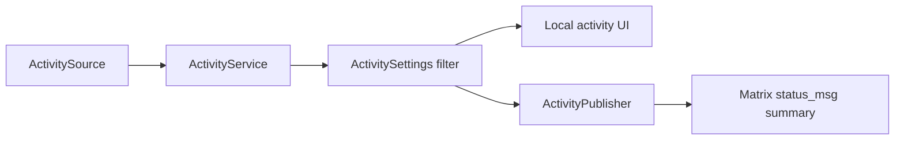

# Activity System

## Status

Stable reference for local activity aggregation, privacy filtering, and the
optional Matrix presence-summary publish path.

## Purpose

Use this map when changing local activity cards, Spotify, Steam, local media
controls, activity settings, activity privacy, or optional Matrix status
publishing.

## Scope

In scope:
- activity-source aggregation and prioritization
- privacy filtering for local display and Matrix publishing
- lossy Matrix presence summary publishing

Not in scope:
- remote rich-presence protocols
- arbitrary provider research notes
- unrelated Home UI presentation changes

## Standard Terms

- **Activity source**: a provider-specific adapter that emits candidate user
  activity.
- **Local activity UI**: the app-only surface that can show richer information
  than the Matrix summary.
- **Publisher**: the component that translates allowed activity into an
  outward-facing status write.
- **Lossy summary**: the intentionally reduced Matrix `status_msg` form used
  instead of remote rich presence metadata.

## Diagram Style

Use left-to-right Mermaid flowcharts with short labels. Keep the local display
path and the Matrix publish path visually separate so privacy gates stay
obvious.

## Pipeline

## Dependency Map

| Area | Primary paths | Key dependencies |
| --- | --- | --- |
| Core model | `lib/client/components/activity/activity_models.dart` | source ids, controls, visibility |
| Source contract | `activity_source.dart` | start/stop/dispose, current activity stream |
| Service | `activity_service.dart` | settings provider, source priority, publishers |
| Settings | `activity_settings.dart`, `activity_settings_page.dart`, `preferences.dart` | local privacy gates |
| Matrix publishing | `publishers/matrix_activity_presence_publisher.dart`, `matrix_user_presence.dart` | Matrix `m.presence` `status_msg` |
| Spotify | `sources/spotify/` | PKCE OAuth, secure token storage, Web API |
| Steam | `sources/steam/` | configured proxy, SteamID64, sanitized artwork |
| Local media | `sources/local_media/`, iOS runner bridge | native media controls |

## Ownership Assumptions

- `ActivityService` is transport-agnostic and owns source merging, privacy
  filtering, selected activity rotation, and publisher fan-out.
- Each source owns its own polling, OAuth/native bridge, and controls.
- UI surfaces should render `UserActivity` and call source-owned controls
  through the service; they should not poll providers directly.
- Spotify and Steam provider/network failures are transient until proven
  otherwise. If a source already has a visible playable activity, DNS,
  timeout, or rate-limit style provider failures may hold that activity for a
  short grace window so flaky network does not immediately clear the local
  card or Matrix status candidate. Confirmed provider states such as no active
  device, no active game, disabled settings, unauthorized tokens, or missing
  configuration still clear immediately.
- Matrix presence publishing is a lossy summary, not remote rich presence.
  Home status bubbles may infer local badge affordances from Inter Galactic's
  own summary shapes: `Playing ...` renders the game badge and
  `Listening to ...` renders the music badge. The Home bubble may drop those
  repeated display prefixes in the tiny pill so the game/song title remains
  readable, but the Matrix `status_msg` itself stays unchanged. Do not use
  those visual badges as proof of remote rich presence metadata.
- Matrix presence publishing owns only the summaries it last wrote. Failed
  publishes or clears are retried with a short bounded backoff so a transient
  homeserver/API failure does not strand an old app-owned `status_msg`.
  Startup target discovery is allowed to keep retrying at the last backoff
  delay until a logged-in Matrix presence target appears, including the
  null-activity clear path used to remove persisted stale ownership markers.
  If a publishable activity is already waiting for startup targets, a later
  empty/degraded source refresh must not overwrite that pending publish while
  the current settings still allow the activity; replay it once a target
  appears.
- Clearing an app-owned status must prefer the current Matrix presence state,
  but it may fall back to an online clear when the presence read fails and the
  persisted ownership marker proves Inter Galactic wrote the old summary.
- Publishing an active activity summary promotes `offline` or `unknown`
  presence reads to `online` so the status message is visible to other users.
  The `unavailable`/away state is preserved when present, so users can keep an
  away-style presence while still sharing music or game activity.
- Matrix status writes use the authenticated Matrix session user id when
  available. Rejected presence writes log only hashed user ids, status mode
  (`present`, `clear`, or `preserve`), message length, Matrix errcode/HTTP
  status, and redacted compact error text; they must not log the actual status
  summary, access tokens, or raw Matrix identifiers.
- Activity publish-decision diagnostics may log provider, kind, visibility,
  source id, generic source status/state, display-field lengths, and a
  non-persistent display fingerprint. They must not log song titles, artists,
  game names, access tokens, or raw Matrix identifiers.
- Spotify Web API diagnostics log only operation, method, path, status class,
  and coarse error labels such as `failed_host_lookup` or
  `connection_closed_before_header`. This is the boundary used to distinguish
  provider polling/control failures from unrelated global network warnings.
- Matrix rate limits are authoritative. If a presence write returns
  `M_LIMIT_EXCEEDED` / HTTP 429 with `retry_after_ms`, the publisher defers
  future writes until that window has passed, keeps only the latest requested
  activity/clear, and stops the current multi-account pass after the first
  server backoff signal.
- Matrix presence rate-limit memory lives in the shared
  `MatrixUserPresenceComponent`, not only in the activity publisher. This keeps
  activity status writes and normal app lifecycle presence writes from
  competing against the same homeserver 429 window. Lifecycle writes that hit a
  shared backoff are deferred quietly, while the activity publisher still
  coalesces to the latest Spotify/Steam/call summary.
- Exact no-op presence updates are skipped before PUT. If the current Matrix
  presence state and `status_msg` already match the requested update, the app
  does not spend another presence write just because a lifecycle or source poll
  fired. A matching server read still refreshes the local SDK cache/database
  and app presence stream from that server response; "no-op" only means no
  extra Matrix PUT.
- Successful direct Matrix presence PUTs must update the Matrix SDK presence
  cache/database and emit the app `UserPresenceComponent` change stream for
  the local user. Home/member/status surfaces read the SDK cache first, so a
  server-accepted write can remain visually stale until sync unless the local
  cache is echoed after success. Blank cached visual reads may perform a
  throttled server refresh so old persisted blank presence does not hide a
  current user-set or activity status.

## Flutter And Native Boundaries

- Flutter/Dart owns activity aggregation, privacy filtering, summary shaping,
  and Matrix publish decisions.
- Native bridges only supply provider-specific local media or OS integration
  data where a source needs it.
- Third-party providers own their own APIs and auth flows; failures there must
  degrade the source without corrupting unrelated activity or presence state.

## Privacy Rules

- Activity is opt-in.
- Local display and each source family are gated separately.
- Publishing to Matrix status is separate from local display.
- Do not publish executable paths, private window titles, tokens, device ids,
  or raw local process metadata.
- Steam/game display must use approved metadata from the source or proxy.
- Spotify and Steam managed build defaults are remembered locally after a build
  provides them. Explicit user-entered Spotify developer settings still win,
  current build defaults are next, and the remembered previous-build values are
  only a fallback so updates that accidentally omit provider defines do not
  make already configured activity connections appear disconnected.

## How To Modify Safely

1. Add new providers as `ActivitySource` implementations.
2. Keep provider credentials in source-specific secure/local storage.
3. Route controls through `ActivityControl` so UI stays provider-neutral.
4. Update privacy filtering before exposing new source data to UI or Matrix.
5. Clear Matrix status by sending the app-owned empty summary path, not by
   assuming `status_msg: null` clears on every SDK/server path.
6. Keep network/presence retries lightweight and fail-open. Do not make
   activity sources block UI or keep polling aggressively because Matrix
   presence is unavailable.
7. When changing direct Matrix presence writes, preserve the successful-write
   cache/event echo and the blank-cache refresh throttle so UI readers do not
   stay pinned to old SDK/database presence values.
8. Add focused tests for source gating, priority, clearing, and Matrix summary
   formatting when behavior changes.

## Related Docs

- `rich-presence-activity.md` remains the detailed implementation history.
