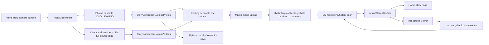

# DM-Scoped Stories

## Purpose

This document describes the current Inter Galactic stories implementation.
Stories are a Home status-strip feature backed by existing Matrix direct-message
rooms. Photo stories use the original v1 baked-image contract. Video stories
use a sibling MVP contract for 30-second-or-shorter video clips with
metadata-rendered overlays. Both are visible in Inter Galactic for 24 hours and
scoped to the sender's existing DM contacts at upload time.

The implementation is intentionally app-side. There is no dedicated stories
server, public story index, or Matrix account-data fanout service.

## Current Scope

- Story media supports photos and MVP short videos.
- Story lifetime is controlled by `expires_at` and defaults to 24 hours.
- Audience is every existing sendable DM room for the active Matrix account at
  upload time.
- Newly created DMs receive future stories only; active stories are not
  backfilled into DMs created later.
- Non-Inter Galactic clients should treat story events as unknown custom room
  events, not normal chat image messages.
- Expiry is enforced by Inter Galactic UI filtering plus best-effort redaction
  of the sender's own story events while the sender app is online.
- Story creation opens on a camera-first 9:16 capture surface. Desktop uses the
  available webcam through a low-load Flutter WebRTC preview/capture path.
  Android and iOS use the platform `camera` plugin for an in-app native preview
  under the same composer overlay, defaulting to the front camera and allowing
  the overlay switch control to choose the rear camera. If native preview or
  capture fails, the composer falls back to the same native `image_picker`
  camera route used by chat photo uploads. Mobile tap still captures a photo;
  holding the capture control records a video with a 30-second ring/countdown
  and auto-stop, then routes the real recorded file into the existing video
  preview/editor before it can be posted. Album, mention selection,
  current-story management, capture, and text-only draft actions all feed the
  same local editor/render/upload path; no new Matrix server work or
  camera-specific story event field is added. Mobile camera switches release
  the active native controller before opening the next front/rear controller,
  because Android and iOS camera plugins should not be asked to hold both
  sessions open at once.
- Story editing is a local composer/editor layer. Camera captures, album picks,
  and text-only drafts become local 9:16 drafts. Crop, text, Unicode emoji,
  visual mention stickers, and account/global sticker overlays are baked into a
  final PNG before upload; the Matrix story event contract remains v1
  `chat.intergalactic.story.photo`. The editor always renders onto a 9:16
  canvas with a user-selectable solid or gradient background; users can either
  fill the canvas with a cropped photo, fit the whole source image inside the
  canvas with colored padding, or start with a blank text-only canvas. Text
  overlays support color, optional background fill, bold/italic style, explicit
  size/rotation buttons, and touch drag/pinch/rotate gestures. Emoji, sticker,
  and visual mention overlays support selected-overlay size and rotation
  controls plus touch drag/pinch/rotate gestures; the compact emoji sheet keeps
  common picks plus a full Unicode picker entry. Story emoji overlays, mixed
  text overlays containing emoji, and reaction chips use the shared native emoji
  font fallback path so iOS can render Apple Color Emoji instead of inheriting
  the app text font. Photo drafts also support local
  Original, Mono, Sepia, Warm, Cool, Fade, and Contrast filters with adjustable
  intensity. Desktop filter selection uses a compact bottom card with preset
  chips and an intensity slider; mobile swipes across the photo canvas cycle
  presets, while the filter button opens the compact intensity control for the
  current preset. Filters are UI-local draft state and are baked by
  `StoryImageRenderer` into the base 1080x1920 PNG canvas before overlays are
  painted, so text, emoji, stickers, and visual mentions remain crisp and the
  Matrix event/upload contract is unchanged. Camera-captured photo drafts use a
  preview-sized normalized base for the immediate transition into the editor;
  upload, manual save, and other full-resolution output paths regenerate the
  1080x1920 base from the original captured bytes before baking overlays. This
  keeps the visible capture transition responsive without lowering posted media
  quality or changing the story event contract. Text-only stories do not expose
  photo filters; their background color/gradient controls remain the styling
  path for blank stories.
- Video stories use `chat.intergalactic.story.video` events. The current MVP
  supports choosing a local video, probing duration/dimensions/poster frame with
  the existing `media_kit` stack, previewing it in a video editor, choosing a
  solid background color for letterboxed/pillarboxed space, adding metadata
  text/emoji/sticker overlays, and uploading only full-source clips whose
  duration is 30 seconds or shorter. The uploader preview and draft strip render
  video media inside the same centered 9:16 story frame as recipients. Fit mode
  normally uses `BoxFit.contain`, while Fill/Crop uses `BoxFit.cover`, so
  non-9:16 clips are edited against the same fit and background that viewers
  will see. Landscape captures and selected landscape
  media stay landscape media, but the story canvas metadata is normalized to the
  portrait 9:16 story frame before upload so all viewed stories remain reliable
  portrait stories. When a video reports a portrait container but its first
  thumbnail frame confidently contains black letterbox/pillarbox bars, the probe
  keeps the encoded media size and also stores visible-content display
  dimensions. Fit mode then centers that visible frame, clips the encoded media
  through it when needed, and paints a story-background matte over the
  non-media canvas regions below overlays. This lets the selected background
  replace video/player-owned black bars above/below or beside the actual video
  content. If the probe is not confident, Fit falls back to contain so dark or
  ordinary landscape videos are not zoom-cropped.
  **There is no video re-encoder on any platform.** Story video trim was
  removed on 2026-08-15 together with the bundled `ffmpeg.exe`, dropping the
  licensing and native-build burden of shipping an FFmpeg trim path for a
  30-second cap. A source clip is either postable as-is or it is not: over-30-second or
  over-size sources are a **validation failure** the person resolves by picking
  a different video, not something the app silently cuts down. That is the
  whole model now, and it is simpler than what it replaced.

  Nothing is staged under `intergalactic/windows/third_party/ffmpeg/`, and
  `intergalactic/windows/CMakeLists.txt` fails the build if **anything** is.
  Note the shape of that guard, because it has been described wrongly more than
  once: it is a single `FATAL_ERROR`, it globs the whole directory rather than
  looking for a named executable, and it names no build configuration, so it
  fires on every build type when the directory is non-empty. It is a negative
  guard against the binary coming back, not a staging step. For that binary's
  historical licence position see `docs/policies/SOURCE_OFFER.md`, which is
  authoritative on it and on which public releases carried it.

  The editor's first stage still exists and is still where a draft is confirmed
  before decoration, but it confirms rather than cuts. The exported-draft,
  drag-the-handles and drag-the-center interactions described in earlier
  revisions of this page are gone with the exporter. Web and any install whose
  platform cannot capture blocks these sources with clear UI rather than
  uploading a long video while pretending a 30-second segment was posted.

  Recording is now **one path on all three capture platforms**: Android, iOS
  and Windows all record through the `camera` plugin, Windows via
  `camera_windows`. The composer's Windows camera selector is populated from
  the plugin's own device list. If the composer closes or the camera lifecycle
  changes while recording is starting, active, or stopping, the composer
  discards the recording before releasing the controller. Story recording stays
  independent of the LiveKit/WebRTC call and streaming path and does not
  capture microphone audio.

  Two affordances are still mobile-only, keyed on a separate predicate from the
  one that gates capture: front/rear lens preference and device-orientation
  handling. Windows joined `_usesNativeCameraCapture`; it did not join
  `_usesMobileCameraCapture`.
  Recipient playback resolves video bytes and poster thumbnails through a
  story-specific Matrix media loader
  because `chat.intergalactic.story.video` is a custom event, while the Matrix
  SDK attachment helper only accepts standard `m.room.message`/sticker
  attachment events. The loader reads the story event's `file` and
  `thumbnail_file` encrypted media metadata directly, downloads the MXC media,
  decrypts it locally when needed, and caches the resolved bytes for the
  existing video player. If the media still cannot be fetched or decrypted, the
  viewer shows a `Video unavailable` failure state instead of an indefinite
  loading spinner. The story viewer renders video media in a centered 9:16
  story frame, uses optional display geometry to clip only known baked
  letterboxes in Fit mode, uses that same frame as the normalized overlay
  canvas, starts audio unmuted unless the user toggles mute, and disables the
  shared embedded video controls so left/right taps remain story
  navigation. Video player instances are keyed by story/media identity to avoid
  reusing a previous story's loaded media when advancing. The story progress
  timer starts only after the video player reports that the media has opened
  and rendered its player frame; slow downloads or decrypt/open work keep the
  top progress bar at zero instead of consuming story time before playback is
  visible. Story rings and
  story-post notifications are driven from
  decrypted, parsed custom story events after Matrix media upload has returned
  usable MXC URIs; there is no local "pending upload" story event sent to other
  users.
- Story reactions are lightweight emoji reactions sent into the same DM room as
  the story. They use a custom encrypted room event so they stay out of normal
  timelines and can be suppressed from story-only unread badge noise.
- Story notification preferences are private account data and are surfaced in
  App > Notifications. Live story post/reaction sync events now create
  app-side story alerts when those settings allow them, without changing
  Matrix push rules or platform pusher behavior. Story posts can carry
  explicit Matrix `m.mentions.user_ids` selected from DM contacts; the
  mentions-only notification mode only fires when the current user's Matrix ID
  is present in that list. The full-screen story viewer surfaces those mentions
  as compact pills under the author header and collapses longer lists behind a
  details sheet. Story reactions mention the original story sender so reaction
  mentions-only can target the owner.
- Manual story photo saves and the optional General setting for auto-saving
  uploaded photo stories use the same platform media-save boundary as image
  attachment downloads. On iOS, supported image stories go through the native
  Photos add-only bridge first instead of the generic Files picker. If Photos
  save is unavailable or denied, manual saves fall back to the existing file
  save path; upload auto-save is best-effort and never changes Matrix upload
  success or story event creation.

## Core Files

| Area | Files |
| --- | --- |
| App abstraction and parser | `intergalactic/lib/client/components/stories/story_component.dart` |
| Matrix implementation | `intergalactic/lib/client/matrix/components/stories/matrix_story_component.dart` |
| Component registration | `intergalactic/lib/client/components/component_registry.dart` |
| DM detection | `intergalactic/lib/client/matrix/components/direct_messages/matrix_direct_messages_component.dart` |
| Home strip entry point | `intergalactic/lib/ui/organisms/home_screen/home_status_strip.dart` |
| Composer/manage sheet | `intergalactic/lib/ui/organisms/home_screen/home_story_composer.dart` |
| Story editor and renderer | `intergalactic/lib/ui/organisms/home_screen/home_story_editor.dart`, `home_story_draft.dart`, `home_story_video_editor.dart`, `home_story_video_tools.dart`, `story_image_renderer.dart` |
| Full-screen viewer | `intergalactic/lib/ui/organisms/home_screen/home_story_viewer.dart` |
| Story notification settings UI | `intergalactic/lib/ui/pages/settings/categories/app/notification_settings/notification_settings_page.dart` |
| Story local notifications | `intergalactic/lib/client/components/push_notification/notification_content.dart`, `intergalactic/lib/client/components/push_notification/notification_response_handler.dart`, `intergalactic/lib/client/components/push_notification/android/android_notifier.dart`, `intergalactic/lib/client/components/push_notification/ios/ios_notifier.dart`, `intergalactic/lib/client/components/push_notification/windows/windows_notifier.dart` |
| Notification badge integration | `intergalactic/lib/client/matrix/matrix_room.dart`, `intergalactic/lib/client/matrix/matrix_space.dart` |
| Focused parser/suppression tests | `intergalactic/test/client/components/stories/story_component_test.dart` |

## Runtime Flow



## Event Contract

Photo stories use a custom room event, not `m.room.message`:

```text
type: chat.intergalactic.story.photo
```

The v1 content shape is:

```json
{
  "v": 1,
  "story_id": "stable story id",
  "created_at": 1780080000000,
  "expires_at": 1780166400000,
  "msgtype": "m.image",
  "body": "image filename",
  "filename": "image filename",
  "m.mentions": {
    "user_ids": ["@mentioned-user:example.org"]
  },
  "url": "mxc://server/plain-upload",
  "info": {
    "mimetype": "image/png",
    "size": 12345,
    "w": 1000,
    "h": 1000
  }
}
```

Encrypted-file uploads use `file` metadata instead of plaintext `url`:

```json
{
  "file": {
    "url": "mxc://server/encrypted-upload",
    "v": "v2",
    "key": {
      "k": "encrypted file key"
    },
    "iv": "encrypted file iv",
    "hashes": {
      "sha256": "encrypted file hash"
    }
  }
}
```

Do not log raw story event content. The `file.key.k`, IV, hashes, event IDs,
room IDs, Matrix IDs, MXC URIs, and ciphertext are sensitive diagnostics
surfaces and should be logged only as counts or short non-reversible hashes.

## Video Event Contract

MVP video stories use a sibling custom room event:

```text
type: chat.intergalactic.story.video
```

The v1 content shape is:

```json
{
  "v": 1,
  "story_id": "stable story id",
  "media_type": "video",
  "created_at": 1780080000000,
  "expires_at": 1780166400000,
  "duration_ms": 24000,
  "trim_start_ms": 0,
  "trim_end_ms": 24000,
  "background_color": 4278190080,
  "media_fit": "fit",
  "display_width": 1080,
  "display_height": 608,
  "baked_letterbox": true,
  "overlays": [
    {
      "id": "overlay-id",
      "type": "text",
      "content": "hello",
      "x": 0.5,
      "y": 0.45,
      "scale": 1.0,
      "rotation": 0.0,
      "color": 4294967295,
      "font_size": 96,
      "bold": true
    }
  ],
  "msgtype": "m.video",
  "body": "story.mp4",
  "filename": "story.mp4",
  "m.mentions": {
    "user_ids": ["@mentioned-user:example.org"]
  },
  "url": "mxc://server/plain-video-upload",
  "info": {
    "mimetype": "video/mp4",
    "size": 1234567,
    "w": 1080,
    "h": 1920,
    "duration": 24000,
    "thumbnail_url": "mxc://server/plain-thumbnail",
    "thumbnail_info": {
      "mimetype": "image/png",
      "size": 12345,
      "w": 180,
      "h": 320
    }
  }
}
```

Encrypted video stories use Matrix encrypted-file `file` metadata for the
video and `info.thumbnail_file` for the poster frame when available. Text,
emoji, sticker overlays, the story-frame background color, and the video
fit/fill mode are not burned into the uploaded video in the MVP; the viewer
renders them above/behind playback from normalized metadata. Matrix `info.w/h`
records the encoded video size. The optional `display_width`,
`display_height`, and `baked_letterbox` fields are additive Inter Galactic
metadata for videos whose encoded frame contains black bars that should be
covered by the selected story background in Fit mode. Older video events
without `background_color` render with the default black story frame, older
events without `media_fit` render as `fit`, and older events without display
geometry fall back to encoded `info.w/h`. Sticker overlays should carry an
`mxc://` `media_uri` when selected from Matrix-backed account/global packs so
recipient devices can resolve the same sticker.

## Reaction Event Contract

Story reactions use a second custom room event:

```text
type: chat.intergalactic.story.reaction
```

The v1 content shape is:

```json
{
  "v": 1,
  "story_id": "stable story id",
  "story_event_id": "$matrix-story-event",
  "story_sender": "@alice:example.org",
  "created_at": 1780080000000,
  "reaction": "❤️",
  "m.relates_to": {
    "rel_type": "m.annotation",
    "event_id": "$matrix-story-event",
    "key": "❤️"
  },
  "m.mentions": {
    "user_ids": ["@alice:example.org"]
  }
}
```

The reaction event is sent to the DM room that carried the story event. In
encrypted DMs it follows the normal encrypted-room send path. Inter Galactic
aggregates one current reaction per reactor per story; sending a new reaction
attempts to redact the previous reaction event before posting the replacement.

Reactions are intentionally small and fixed for this slice. The current quick
set is heart, laugh, wow, cry, fire, and thumbs up. Freeform reaction text,
comments, reply threads, public reaction counts, and push-notification tuning
remain future product work.

## Parsing Rules

`parseStoryEventContent` accepts only v1 image stories that satisfy all of the
following:

- `story_id` is a non-empty string.
- `created_at` and `expires_at` are millisecond timestamps.
- `expires_at` is after `created_at`.
- The story is not expired unless the caller explicitly asks to parse expired
  events for notification-marker cleanup.
- `created_at` is not more than five minutes in the future.
- The lifetime is not more than 25 hours.
- `msgtype` is absent or `m.image`.
- MIME type, when present, starts with `image/`.
- Declared media size is non-negative and no larger than 50 MB.
- The media pointer is an `mxc://` URI from either `url` or `file.url`.
- Encrypted media metadata has Matrix encrypted-file v2 fields: `v`, `iv`,
  `key.k`, and `hashes.sha256`.

Malformed, redacted, non-image, oversized, future-invalid, and expired active
stories are hidden from the story UI.

`parseStoryVideoEventContent` accepts only v1 video stories that satisfy all of
the following:

- `story_id`, `created_at`, and `expires_at` satisfy the same lifetime rules as
  photo stories.
- `msgtype` is absent or `m.video`.
- MIME type, when present, starts with `video/`.
- Declared media size is non-negative and no larger than 100 MB.
- The media pointer is an `mxc://` URI from either `url` or `file.url`.
- Encrypted media metadata has Matrix encrypted-file v2 fields.
- `duration_ms` is present, positive, and no more than 30 seconds.
- `trim_start_ms` and `trim_end_ms` describe a positive range within
  `duration_ms` and the selected range is no more than 30 seconds.
  **These fields stay in the wire contract even though trim was removed.**
  Since 2026-08-15 this client always sends the full source — `trim_start_ms`
  is `0` and `trim_end_ms` is `duration_ms` — but receivers must keep honouring
  a narrower range, because stories sent by older builds are still in flight
  and the validation above is what rejects a malformed one. Do not delete these
  fields or stop reading them on the strength of the sender no longer varying
  them.
- Overlay metadata is bounded, normalized, and limited to text, emoji, and
  sticker overlay types.

`parseStoryReactionEventContent` accepts only v1 reactions that satisfy all of
the following:

- `story_id` is a non-empty string.
- `story_event_id` looks like a Matrix event ID.
- `story_sender` looks like a Matrix user ID.
- `created_at` is not more than five minutes in the future and not older than
  30 days.
- `reaction` is one of the fixed story reaction choices.
- `m.relates_to` is an `m.annotation` relation whose `event_id` and `key`
  match the story event and reaction.

The Matrix story component also rejects reaction events when the room does not
look like the DM containing both the story sender and reactor, when the target
story is unknown, or when the story sender is reacting to their own story.

## Composer And Upload Flow

The Home composer opens as a full-screen camera surface instead of a bottom
sheet. On desktop, the camera preview is framed as a 9:16 story canvas, but the
underlying WebRTC request stays at a conventional 1280x720, 30 FPS ideal feed
and lets the editor crop/fit into the story canvas. The left rail gives access
to current own stories, mention selection, and the album picker; the center
capture control snapshots the active WebRTC video track; the right rail creates
text-only drafts and, on Windows, shows a camera input selector populated from
the `camera` plugin's own device list. The preview during Windows recording is
the plugin's preview, like Android and iOS — the FFmpeg DirectShow recorder
that previously enumerated devices, released the WebRTC preview to avoid a
camera-in-use failure, and piped MJPEG frames over stdout was deleted with the
bundled binary on 2026-08-15.
Selected drafts appear in a floating review tray with save, edit, and remove
actions plus Share. Save renders the selected draft through the same
1080x1920 PNG renderer used for upload, so users can keep the baked edits
locally before submitting a story without changing the Matrix event contract.
The review tray keeps the visible draft image in a centered 9:16 frame while
allowing a wider control footprint for the overlay actions, so action buttons
must not resize or stretch the story preview itself.

On Android and iOS, the composer does not keep a live WebRTC camera stream open.
Instead it initializes the platform `camera` plugin and renders
`CameraPreview` inside the existing 9:16 composer surface, so album, mentions,
current-story, capture, camera-switch, and text-only controls stay in the same
screen. The center capture control calls `CameraController.takePicture()` and
turns the resulting file into the same local story draft as album and desktop
captures. The front/back toggle swaps between known native camera descriptions
without using the older mobile WebRTC switch path. The active native controller
is closed before the requested front or rear controller is opened, and the rear
selection prefers the main back sensor when the platform lists multiple back
cameras. If native preview initialization or capture is unavailable, capture
falls back to `image_picker` with `ImageSource.camera`, matching the chat photo
upload path.

The mobile story composer keeps the surrounding capture chrome on the portrait
story surface so rotating the phone does not move controls off screen, but it
does not lock the native camera controller's capture orientation. Users can
hold the device landscape for photos or videos; that captured landscape media
then opens in the portrait editor canvas in Fit mode unless the user chooses a
different placement.

The album picker still uses the existing image/file picker pattern with
in-memory bytes. It supports selecting multiple photos, converts them into
UI-local story drafts, reviews them before send, and rejects original files over
the 50 MB story cap.

The editor is intentionally pre-upload and wire-compatible:

- Each selected image becomes a `StoryDraft` with normalized source bytes, a
  9:16 canvas background, an image-fit mode, and optional UI-local filter
  preset/intensity. The default mode center-covers the photo; the alternate mode
  fits the whole image with the selected solid color or gradient as padding.
- Text-only stories create a photo-less `StoryDraft` with a blank 9:16 canvas,
  default black background, and the same solid/gradient background controls.
  Crop/fill controls are hidden for text-only drafts because there is no source
  photo to transform.
- The first newly selected draft opens in the full-screen editor immediately.
- Draft thumbnails show the latest rendered preview and expose save, edit, and
  remove controls. Draft thumbnails preserve the rendered image aspect ratio
  inside the preview frame instead of stretching or cover-cropping pending
  images. The save action renders the draft as a local `image/png` with the
  same baked canvas, filters, backgrounds, text, emoji, stickers, and visual
  mention overlays that sharing would upload.
- The composer can attach story mentions from existing DM contacts as metadata.
  The editor can also add visual mention stickers from DM contacts. Visual
  mentions are baked into the rendered PNG, and their Matrix IDs are unioned
  with composer-selected mentions into `m.mentions.user_ids` so mentions-only
  notification policy and viewer mention metadata still work. The same mention
  list is sent to each target DM room. The viewer displays the mention metadata
  as compact header pills, showing the first two mentions inline and a `+N`
  overflow chip that opens the complete mentioned-people list.
- Crop uses the existing crop utility surface with a fixed 9:16 aspect ratio
  and 90-degree rotate controls.
- Photo filters are applied only to the base story canvas. The renderer draws
  the filtered base image first, then paints text, emoji, stickers, and visual
  mentions after the filter pass so overlays remain unfiltered.
- Text, Unicode emoji, visual mention, and account/global sticker overlays are
  UI-only draft data. Text overlays store color, optional background fill color,
  base font size, bold/italic flags, scale, and rotation. Emoji, visual mention,
  and sticker overlays store size/scale/rotation and can be adjusted by
  selected-overlay buttons or mobile pinch/rotate gestures. Emoji overlays can
  start from the curated common grid or the full Unicode picker reached through
  the plus button.
- Stickers come from the active account's global packs and owned packs only.
  Per-DM room packs are intentionally excluded because a story upload fans out
  to multiple DM rooms and the composer has no single room context.
- Creating image drafts normalizes the selected/captured source onto the 9:16
  story canvas through a background `compute` task so capture and picker loading
  indicators can keep animating while large images decode and resize.
- Sharing queues every draft for a background render into a 1080x1920
  `image/png` `StoryPhotoUpload`, validates the 50 MB story cap again, and
  then calls the existing `StoryComponent.uploadPhotos` path. The composer
  closes after the queue is accepted so the app does not feel locked while
  Matrix media upload and per-DM sends finish. Saving before submission uses
  the same renderer but only writes a local file; it does not upload media,
  create outbox entries, or send Matrix events.

`MatrixStoryComponent.uploadPhotos`:

1. Reads current DM rooms from `DirectMessagesComponent`.
2. Keeps only rooms that are direct messages and can send the required event
   type.
3. Creates one `story_id`, `created_at`, and `expires_at` per selected photo.
4. Sends the story event into every current target DM room.
5. Adds a local own-story preview backed by the selected in-memory bytes.
6. Saves a private outbox record with recipient room/event IDs for deletion and
   expiry redaction.

DM detection currently includes Matrix direct chats and complete joined
one-to-one rooms with exactly two joined members. Special room types are
excluded from the one-to-one fallback path.

`StoryComponent.trackPendingStoryUpload` exposes a UI-only pending upload
state while queued sharing is rendering/uploading. Matrix and demo stories emit
`onStoriesChanged` when that state starts and ends, allowing the Home strip to
show a distinct pending ring for the current account without adding Matrix
events or account-data schema.

## E2EE And Media

Encrypted DM rooms use the normal encrypted-room send path for the custom story
event. The event content is encrypted by Matrix room encryption before it is
sent over the wire.

For the image bytes:

- Edited stories are ordinary baked PNG image bytes by the time they enter the
  upload path. Recipient clients do not need a story-editor renderer and see the
  same v1 story image event as before.
- When the Matrix SDK file-encryption helper is enabled, the app encrypts the
  selected image bytes before media upload and sends encrypted Matrix `file`
  metadata in the story event.
- When file encryption support is not available, the app can still send the
  encrypted custom room event, but the uploaded MXC media bytes are not
  client-side encrypted. Treat this as a release-validation caveat for any
  platform or SDK configuration that disables `fileEncryptionEnabled`.

The sender outbox deliberately stores only a media summary for management:
encrypted status, MXC URL, and image `info`. It does not copy encrypted file
keys, plaintext image bytes, or the full event payload into account data.

## Sync And Aggregation

`MatrixStoryComponent` is registered as a client component, and
`MatrixStoryRoomComponent` is registered as a room component.

On post-login initialization, the component:

- loads viewed-state account data;
- loads the sender's own outbox account data;
- prunes expired outbox records and redacts expired recipient events on a
  best-effort basis;
- refreshes active stories from current DM rooms;
- starts a one-minute timer to prune expired visible stories and outbox records.

Story discovery is intentionally bounded:

- local room events are scanned with `recentHistoryScanLimit` set to 120;
- Matrix room search requests include the story custom event type and encrypted
  events with the same limit;
- encrypted events are decrypted and only kept if the decrypted event is the
  story photo or story reaction custom type;
- live sync events are processed per room through a serialized queue so
  redactions cannot race story add/decrypt work.

The visible aggregate is grouped by Matrix sender user ID and sorted
oldest-to-newest within each author.

Reaction discovery uses the same bounded local/history/live path as story
photos. History refresh processes story photo events before reaction events so a
reaction found in the same scan can attach to its target story. Reaction groups
are pruned when their story is deleted or expires.

## Home UI Behavior

The Home status strip builds entries from the signed-in account plus recent DM
contacts. It subscribes to story changes per active client.

For self/account entries, the strip also listens to `ClientManager` client
update events. Matrix clients emit those events when their `self` profile is
refreshed from cache/server, so first-sign-in avatars and display names can
replace placeholders without waiting for an app restart.

Current interactions:

- Tapping your own bubble opens the composer/manage sheet.
- Long-pressing your own bubble opens profile/status.
- Tapping a contact with active stories opens the full-screen story viewer.
- Tapping a contact without active stories opens the DM when one is available.
- Long-pressing a contact opens the DM when one is available.
- Contacts with unseen stories sort ahead of ordinary contacts after the self
  bubble, while presence/status and recent DM activity remain the secondary
  ordering signals.
- Active unseen stories show an accent ring.
- Active seen stories show a muted ring.
- Queued own-story uploads show a distinct pending ring until the background
  render/upload task finishes.
- Contacts whose exposed Matrix presence/status summary starts with
  `Playing ...` show a small gamepad badge in the lower-left of the status
  bubble. This uses the existing opt-in basic activity summary published by the
  activity component; it does not add rich remote activity metadata, Matrix
  account data, story event fields, or a new server contract.
- Once a live Matrix presence response is loaded, that presence is
  authoritative for status text. Profile-status fallback text is used only
  while live presence is unknown; it must not override a loaded blank/current
  presence because that can surface stale activity such as yesterday's song.
- Desktop pointer drag is enabled on the horizontal status strip, so mouse
  users can click-drag the status line in addition to wheel/trackpad scrolling.
- Presence/status remains visible but secondary to the story ring.

The viewer is full-screen and story-frame first. It pre-caches the current image
before starting the progress timer; video stories start after the parsed story
is prepared and render inside the same centered 9:16 frame used by metadata
overlays. The viewer advances every five seconds for photos or after the parsed
video duration for videos, supports right-half tap for next, left-half tap for
previous, and marks the current story seen only after the current media is
ready. Own stories can be deleted from the viewer or the composer/manage sheet.
If a story carries `m.mentions.user_ids`, the viewer shows compact mention
pills under the author header; tapping a pill or overflow chip pauses the story
timer while a bottom sheet lists every mentioned user with display names when
the DM room has membership data.

Non-own stories show a compact quick-reaction bar in the viewer. Own stories
show reaction chips in the viewer, and the composer/manage sheet shows compact
reaction count pills on active own-story thumbnails.

## Account Data

The implementation uses three private account-data keys:

- `chat.intergalactic.stories.outbox.v1`
- `chat.intergalactic.stories.viewed.v1`
- `chat.intergalactic.stories.notification_settings.v1`

Outbox records include:

- `story_id`
- `created_at`
- `expires_at`
- recipient `room_id` / `event_id` pairs
- media summary fields needed for local management

Viewed state tracks story keys per account, effectively `senderId|storyId`,
and drives the seen/unseen ring state. Viewed state is UI state only; it is not
a read receipt and does not affect Matrix unread counts.

Notification settings are per account:

```json
{
  "v": 1,
  "story_posts": "off",
  "story_reactions": "contacts",
  "sound": true
}
```

`story_posts` and `story_reactions` use enum values so the setting can grow
with future audience controls:

- `off`
- `mentions_only`
- `contacts`
- `all`

For the current DM-scoped story model, `contacts` and `all` have the same
effective audience. `mentions_only` requires explicit `m.mentions.user_ids`
metadata on the story event or reaction event. Defaults are conservative:
story post alerts are off, story reaction alerts are contacts, and sound is on
when a story alert is shown.

## Deletion And Expiry

Manual delete and expiry pruning use Matrix redaction against each known
recipient event from the sender outbox.

Deletion behavior:

- The app attempts to redact all known recipient events for that story.
- If any redaction fails, the local outbox/story state is kept so the user can
  retry instead of silently losing management state.
- If all redactions succeed, the story is removed locally and from outbox.

Expiry behavior:

- Active story lists prune expired items immediately from UI.
- A one-minute timer prunes visible stories and own outbox records.
- Expired own stories are redacted best-effort only while the sender app is
  online.
- Homeserver media retention and remote history remain governed by normal
  Matrix media/redaction behavior.

## Notification Badge Suppression

Story events and story reaction events are custom room events, but Matrix raw
unread counts can still include them. Inter Galactic suppresses story-only
badge noise locally.

Current behavior:

- Parseable story photo and reaction events create `StoryNotificationMarker`
  entries by room.
- Markers are retained until story expiry plus seven days.
- `MatrixRoom.notificationCount` asks the story component how many unread story
  markers are newer than the latest own receipt.
- The suppressed count is clamped to the raw Matrix notification count and
  subtracted for local display.
- DM and space notification lists update from room `onUpdate` notifications, so
  story-only rooms should not light up the local sidebar badges.

This suppression is display-only. It does not mark rooms read, change Matrix
push rules, remove server unread counts, or hide ordinary non-story messages.

Story notification preferences are separate from badge suppression. Live
story post/reaction events that arrive through sync, decrypt, parse, and pass
the per-account setting are handed to `NotificationManager` as story-specific
local notification content. Story post alerts are deduped per signed-in
account, sender, and `story_id` before that handoff, so one upload fanned out
through multiple DM rooms can still show only one local story-post alert.
Per-room story markers remain separate for badge suppression. Windows renders
story notifications as toasts without the normal message Reply action and
respects the story sound toggle. Android and iOS now render the same story
content with stable per-story notification IDs, story-open tap payloads, and no
message reply actions; Android also omits bubble metadata for story alerts.
Story notification payloads keep the room/client route for grouping, clearing,
snooze, and fallback, but selected notifications open the full-screen story
viewer at the target story id/event id when it is still active. The delivery
path does not install Matrix push rules, alter homeserver notification counts,
or allow encrypted story content to be matched server-side. On iOS/APNs native
responses, acknowledgement waits for the story viewer to start or for the
stale-story fallback room selection to succeed, matching the existing
cold-launch room notification retry contract.

Startup/recent-history refresh intentionally does not replay notifications for
older story events. Background platform push remains a later phase.

## Security And Privacy Boundaries

- Stories are local-device/app behavior built on ordinary Matrix media upload,
  room events, sync/history, private account data, and redaction.
- Encrypted DMs should keep both story event content and story media E2EE when
  file encryption is enabled.
- Story and reaction metadata in room events is visible to the same audience
  that can read the room event.
- Sender outbox account data is private account data but must not contain
  plaintext media bytes or encrypted file keys.
- Logs must not include raw Matrix identifiers, MXC URLs, encrypted-file key
  material, ciphertext, event bodies, or full account-data payloads.

## Current Validation State

As of 2026-05-30, the story feature has had:

- focused parser and notification-suppression tests;
- render and badge fixes after user logs showed blank story viewers and story
  badge noise;
- review follow-ups for serialized sync handling, image-size enforcement, and
  delete-error recovery;
- user smoke validation of the story feature after those fixes;
- PR merge for the story slice;
- editor follow-up validation for text size/rotation and the full emoji picker.
- reaction MVP verification;
- account-data-backed story notification settings.

Manual validation is still the best release gate for platform and homeserver
behavior:

- Alice uploads multiple photos; Bob can view and tap through them.
- Alice uploads a landscape or square photo using Fit whole photo; Bob sees the
  full image on the selected solid or gradient 9:16 canvas rather than a forced
  crop.
- Encrypted DM story media decrypts on Bob's device.
- Story-only uploads do not create local DM/space badge noise.
- Delete redaction removes active stories after sync.
- Bob reacts to Alice's story; Alice sees the reaction in her own story viewer
  or composer/manage sheet, and the reaction does not render as a normal chat
  timeline item.
- Expired stories disappear and own expired events redact best-effort.
- App restart still rediscovers active stories that remain in the bounded
  recent-history window.
- App > Notifications shows per-account story notification settings, persists
  them in private account data, and keeps true background push behavior
  unchanged.
- With story post/reaction notification modes set to `All`, live incoming
  story posts and reactions produce local desktop and mobile story
  notifications after sync/decrypt. With story post mode set to `Mentions
  only`, only stories whose mention list includes the current user should
  notify. If the same story upload appears through multiple DM rooms for the
  same account pair, only one story-post notification should be shown.
  Selecting the notification should open the full-screen story viewer at the
  target story; the DM room is the fallback only when the story has expired,
  been deleted, or cannot be resolved. Notification replay for older history and
  true background push remain out of scope.

## Non-Goals For V1

- Captions
- Replies or comments
- Close-friends lists
- Public profile discovery
- Selected-room audience picker
- Server-side story indexes
- Guaranteed homeserver media purge after expiry
- Backfill of already-published stories to newly created DMs
- Structured captions or editable overlay metadata in Matrix events
- True background push delivery or per-story audience selection
