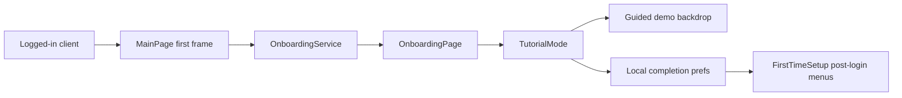

# Onboarding System

## Status

Stable local-guidance reference. This doc covers the desktop-first onboarding
path and its current replay/setup boundaries.

## Purpose

Use this map when changing first-run tutorial behavior, post-login setup menus,
Help tutorial replay, or offline-demo guardrails.

## Scope

In scope:
- local onboarding completion state
- tutorial launch and replay behavior
- relationship between onboarding and post-login setup menus

Not in scope:
- Matrix account data
- remote sync of onboarding state
- mobile-first onboarding redesign work

## Standard Terms

- **Onboarding**: the guided local tutorial flow shown after login on supported
  layouts.
- **Replay**: a user-initiated tutorial launch from Help settings that should
  not silently reset completion state.
- **Post-login setup**: follow-up setup menus that can still appear after the
  tutorial completes or is skipped.
- **Guided demo backdrop**: the isolated offline demo app shell shown behind the
  production tutorial so first-run and replay flows have stable sample context
  without using a real Matrix account.
- **Demo preview**: a developer/review tutorial mode that uses the guided demo
  backdrop but must not write onboarding completion preferences.
- **Legacy placeholder**: the old card-only tutorial mode, kept behind
  developer access for future copy or layout experiments.

## Diagram Style

Use left-to-right Mermaid flowcharts with short labels. Keep local-state
boundaries explicit so contributors do not confuse onboarding preferences with
Matrix-backed account state.

## Pipeline

## Dependency Map

| Area | Primary paths | Key dependencies |
| --- | --- | --- |
| State | `lib/ui/onboarding/onboarding_state.dart` | local completion/version |
| Service | `lib/ui/onboarding/onboarding_service.dart` | `Preferences` |
| Mode model | `lib/ui/onboarding/tutorial_mode.dart` | production completion writes vs no-write preview modes |
| Controller/UI | `lib/ui/onboarding/onboarding_controller.dart`, `onboarding_page.dart`, `onboarding_content.dart` | Flutter navigation |
| Guided backdrop | `lib/ui/onboarding/tutorial_demo_backdrop.dart`, `demo_tutorial_content.dart`, `tutorial_scene.dart`, `tutorial_anchor.dart` | isolated `DemoClient`, measured tutorial anchors, scene choreography |
| Startup trigger | `lib/ui/pages/main/main_page.dart` | first frame, logged-in client manager, desktop layout gate |
| Preferences | `lib/config/preferences.dart` | `onboarding.completed`, `onboarding.version`, `onboarding.completedAt` |
| Replay | `lib/ui/pages/settings/categories/help/help_tutorial_page.dart` | Help settings, hidden in mobile layout |
| Post-login setup | `lib/utils/first_time_setup.dart`, setup pages | setup menu availability |

## Ownership Assumptions

- Onboarding is local app guidance, not Matrix account data.
- Tutorial completion is versioned local preference state.
- MainPage owns the post-login trigger after the app has rendered a logged-in
  main UI.
- Help settings owns replay and must not reset completion accidentally.
- `TutorialMode.realAccount` is the production first-run/replay mode. It uses
  the guided offline demo backdrop, but Skip and Finish write local onboarding
  completion.
- `TutorialMode.demoPreview` and `TutorialMode.legacyPlaceholder` are
  no-completion modes for developer/review use; Skip and Finish must not write
  local onboarding completion.
- Offline demo sessions must skip Matrix-specific post-login work.

## Flutter And Native Boundaries

- Flutter/Dart owns onboarding state, local preferences, tutorial routing, and
  setup-menu sequencing.
- Flutter/Dart also owns the guided demo backdrop and its isolated
  `DemoClient`; the backdrop may reuse inert production widgets but must remain
  local sample state.
- Native platform runners do not own onboarding behavior beyond normal app
  startup and window/layout hosting.
- No Matrix or server round-trip should be required to mark onboarding
  complete, skipped, or replayed.

## Guardrails

- Do not write tutorial state to Matrix account data without a new decision.
- Do not block login or session restore on tutorial rendering.
- Do not show first-run onboarding for demo-only clients.
- Do not let demo preview, legacy placeholder, or the offline backdrop mutate a
  real Matrix account, register pushers, or start Matrix sync.
- Keep the current guided tutorial desktop-only. Mobile layout skips automatic
  launch, hides Help replay, and should stay restricted until a mobile-specific
  tutorial path is ready.
- Bump `OnboardingService.currentVersion` only when old completed users should
  see the tutorial again.
- Keep post-login setup menus after onboarding so recovery/push setup can still
  run when needed.

## How To Modify Safely

1. Decide whether the change is tutorial content, local state, trigger timing,
   or setup-menu behavior.
2. For content-only changes, avoid changing completion/version semantics.
3. For a new mandatory tutorial pass, bump the version and update tests.
4. Keep replay paths independent from completion marking unless the user
   finishes or skips from the tutorial itself.
5. For mode/backdrop changes, confirm the production `realAccount` path still
   records completion and no-write preview modes still avoid completion writes.
6. Validate offline demo and restored-session paths separately.

## Related Docs

- `offline-demo-mode.md` owns demo-session boundaries.
- `tutorial-demo-preview.md` owns the detailed guided backdrop scene model,
  current reusable-anchor coverage, and developer/review preview limitations.
- `settings-information-architecture.md` owns Help/Settings placement.
