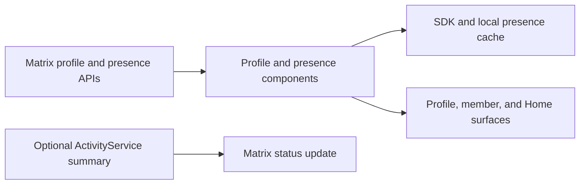

# Profile And Presence

## Status

Stable reference for user-profile presentation and Matrix presence state. It
separates profile data and user-controlled status from the optional local
activity publishing path.

## Purpose

Use this map when changing profile cards or editors, avatars and banners,
custom profile fields, user status, or Matrix presence reads and writes.

## Scope

In scope:

- profile lookup, display, and self-profile editing
- avatars, banners, bios, pronouns, badges, timezones, and profile color choices
- Matrix presence status and custom status messages
- presence cache refresh, rate-limit handling, and UI update streams

Not in scope:

- local activity aggregation or third-party activity providers; see
  `activity-system.md`
- room receipts and typing indicators; see `../matrix/room-interactions.md`
- account authentication, verification, or recovery; see `../matrix/matrix-e2ee.md`

## Architecture

Profile fields and presence are related in the UI but have separate component
contracts. The profile component supplies identity and profile content; the
presence component supplies a current availability state and optional status
message. Activity publishing can write a deliberately reduced status summary,
but it does not create remote rich-presence metadata.

## Profile Boundary

`UserProfileComponent` resolves a `Profile` for any user identifier and owns
self-profile updates. Profiles provide identity, display name, avatar, banner,
default color, and source data. Optional capability interfaces add badges,
bio, pronouns, timezone, custom color scheme, and presence.

`UserProfile` is the main presentation/editor surface. It loads the profile,
preloads available images, and adapts its container to desktop and mobile. A
profile action should use the component contract rather than mutate a Matrix
model from the UI. Starting a direct message is deliberately a separate
DirectMessagesComponent flow.

Profile information can have different visibility and sensitivity. In
particular, the timezone action requires a confirmation before writing the
current device timezone. New profile fields must define their persistence,
visibility, and removal behavior before the UI exposes them.

## Presence Boundary

`UserPresenceComponent` exposes presence changes as a stream and reads or
writes a user's Matrix availability and optional custom status message. Matrix
presence maps to `offline`, `online`, or `unavailable`; the app also uses
`unknown` when no reliable state is available.

`MatrixUserPresenceComponent` keeps the Matrix SDK cache and local database in
step after a successful direct presence write so profile, member, and Home
surfaces do not wait for a later sync to update. It can refresh a blank cached
status from the server on a bounded schedule, coalesces rate-limit delays, and
skips writes that already match server state. Presence diagnostics use hashed
identifiers and status metadata rather than raw status text.

A profile status update writes both the profile-facing status and Matrix
presence. Clearing a status is explicit: the component preserves the requested
availability while removing the app-owned status message. Do not treat a
profile-card update as proof that a remote Matrix presence write succeeded.

## Activity Relationship

`ActivityService` can publish an opt-in, privacy-filtered `status_msg` summary
such as a game or music state. This is intentionally lossy and must not be
used as remote rich-presence data. User-entered profile status, local activity
display, and outward Matrix activity publishing have separate privacy controls;
see `activity-system.md` for the full source and publishing contract.

## Important Paths

| Area | Primary paths |
| --- | --- |
| Profile contract | `intergalactic/lib/client/components/profile/profile_component.dart` |
| Matrix profile adapter | `intergalactic/lib/client/matrix/components/profile/` |
| Presence contract and implementation | `intergalactic/lib/client/components/user_presence/user_presence_component.dart`, `intergalactic/lib/client/matrix/components/user_presence/matrix_user_presence.dart` |
| Profile surface | `intergalactic/lib/ui/organisms/user_profile/` |
| Activity publishing relationship | `intergalactic/lib/client/components/activity/`, `docs/architecture/features/activity-system.md` |

## How To Modify Safely

1. Keep profile content, presence state, and activity summaries as separate
   concepts even when one UI surface shows all three.
2. Update the Matrix cache and presence change stream after a successful direct
   write; otherwise local UI can remain stale until sync.
3. Respect server rate limits and retain only the latest requested presence
   update while waiting.
4. Do not log raw status text, tokens, or raw Matrix identifiers in presence
   diagnostics.
5. Add focused coverage for profile/presence transitions and cache updates when
   behavior changes.

## Related Docs

- `activity-system.md` and `rich-presence-activity.md` for local activity and
  the opt-in Matrix summary publisher.
- `../matrix/room-interactions.md` for receipt and typing preferences.
- `../matrix/matrix-e2ee.md` for account, verification, and recovery boundaries.
