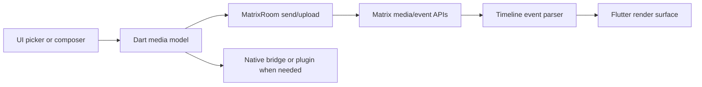

# Media Pipeline

## Status

Stable architecture reference for media send, upload, parse, render, and
plugin-backed media capabilities across standard attachments and Inter Galactic
media features.

## Purpose

Use this map when changing attachments, GIFs, URL previews, custom emoji,
stickers, voice messages, soundboard playback, media rendering, or
plugin-backed media capabilities.

## Scope

In scope:
- attachment and media send/render flow
- URL preview and provider-fallback boundaries
- Flutter/native/plugin responsibility splits for media behavior
- Inter Galactic-specific media feature boundaries such as stories and
  soundboard playback

Not in scope:
- release-only packaging steps
- temporary media debug transcripts
- unrelated call-stream transport tuning

## Standard Terms

- **Standard media**: normal Matrix attachment events such as `m.image`,
  `m.file`, `m.audio`, and `m.video`.
- **Timeline media**: the parsed event content that drives attachment rendering
  in the chat timeline or related viewers.
- **Provider fallback**: a bounded direct client fetch path used only for
  approved preview providers when the homeserver or optional preview service is
  insufficient.
- **Baked editor output**: media that is locally rendered into a final upload
  artifact before the Matrix event is sent.

## Diagram Style

Use left-to-right Mermaid flowcharts with short labels. Make the upload/send
path and the parse/render path explicit so contributors inspect both sides of
the boundary before changing media behavior.

## Pipeline

## Dependency Map

| Area | Primary paths | Key dependencies |
| --- | --- | --- |
| Attachments | `lib/client/attachment.dart`, `lib/client/matrix/matrix_room.dart`, `lib/client/matrix/matrix_attachment.dart` | Matrix media upload, MIME detection |
| Timeline media | `lib/client/matrix/timeline_events/`, `lib/ui/molecules/timeline_events/` | Matrix event content, preview preferences |
| GIFs | `lib/client/matrix/components/gif/`, `lib/ui/molecules/gif_picker.dart` | relay or user KLIPY key, Matrix upload |
| URL previews | `lib/client/matrix/components/url_preview/`, `lib/ui/molecules/url_preview_widget.dart` | sanitized durable cache, homeserver preview API, optional Inter Galactic preview service, provider-limited direct fallback fetcher |
| Emoji/stickers | `lib/client/matrix/components/emoticon/`, `lib/ui/molecules/emoticon_picker.dart` | Matrix image packs, room/space/account scope |
| Message effects | `lib/client/components/message_effects/`, `lib/client/matrix/components/message_effects/`, `lib/ui/molecules/message_input.dart` | Matrix message events, composer commands, local render effects |
| DM stories | `lib/client/components/stories/`, `lib/client/matrix/components/stories/`, `lib/ui/organisms/home_screen/home_story_*.dart`, Android/iOS runner bridges, `docs/architecture/features/dm-stories.md` | Matrix custom room events, WebRTC camera still capture, native mobile camera capture/recording, local 9:16 baked-image editor, Android/iOS native story-video trim export, Windows bundled LGPL-only FFmpeg/FFprobe trim export and video-only DirectShow recording, Matrix media upload, encrypted file metadata |
| Voice messages | `lib/client/components/voice/`, Android/iOS runner bridges, `audio_player.dart` | native recorder, attachment upload |
| Soundboard | `lib/client/components/soundboard/`, `lib/client/matrix/components/soundboard/` | Matrix state/events, active call playback |
| Media plugins | `plugins/intergalactic_noise_suppression/`, `plugins/intergalactic_windows_share/` | native APIs, Flutter WebRTC |

## Flutter And Native Boundaries

- Flutter owns composer intent, local preferences, Matrix event construction,
  upload orchestration, camera-preview UI, and rendering decisions.
- The Accessibility > Pause animated media setting freezes app-owned image
  provider surfaces at their first decoded frame for GIF/WebP/custom
  emoji/sticker previews, attachment-style image rendering, and story
  image/sticker render surfaces. This is a local render decision only; Matrix
  media bytes, GIF relay/provider behavior, image-pack state, upload/send
  paths, story draft metadata, trim/export, recording, and video playback
  remain unchanged.
- Native runners own OS permission prompts and platform recording/capture APIs.
- iOS image downloads use a native Photos add-only bridge for image attachment
  bytes. Non-image iOS downloads still use the generic Files save path, and
  Android/web keep their existing platform save behavior.
- Story photo draft saves and the optional uploaded-story auto-save setting
  reuse the same iOS Photos add-only image-save bridge. Manual story saves fall
  back to the existing file-save path if Photos is unavailable or denied.
  Automatic story photo saves are best-effort after a successful upload and
  must not change Matrix upload or event creation results.
- Mobile focused-media sharing uses the local `media_share` runner channel on
  Android and iOS. The bridge writes selected attachment bytes to a temporary
  cache file and invokes the native share sheet; it does not alter Matrix media
  content or persist a new app-level copy.
- The composer Gallery action uses mixed image/video selection through
  `image_picker.pickMultipleMedia()`. Android startup explicitly enables
  `ImagePickerAndroid.useAndroidPhotoPicker`, and the Android manifest requests
  the Google Play services Photo Picker backport, so Gallery stays a local
  photos/videos picker while the separate Files action remains the generic
  document/provider picker.
- The mobile composer Camera action is Android/iOS only and uses
  `image_picker` camera capture for either a still photo or a recorded video.
  Captured media becomes the same `PendingFileAttachment` used by Gallery and
  Files, then flows through `AttachmentProcessor` before the normal Matrix
  media send path.
- The Emoticon Creator is a local-first image-pack helper. It uses the
  app-owned `ImageCutoutService` to pick a source photo, generate a transparent
  PNG cutout, preview/edit the mask, and save a local draft before the existing
  Matrix image-pack add/update callback receives PNG bytes. Source photos are
  not uploaded during pick, cutout, preview, or refinement. Supported mobile
  platforms use native Apple Vision and Android ML Kit backends behind the same
  service boundary, while the pure Dart local edge-segmentation path remains the
  fallback implementation. Desktop ONNX/model-backed segmentation remains an
  explicit follow-up backend behind that boundary.
- Plugins own low-level capabilities such as RNNoise capture processing and
  Windows shared-content audio.
- Unsupported platforms must fail safely through stubs or hidden UI, not by
  leaking platform imports into shared Dart.

## Matrix Boundaries

- Standard media remains standard Matrix event/media content such as `m.image`,
  `m.file`, `m.audio`, and `m.video`.
- Local appearance choices, message backgrounds, and media preview preferences
  stay local and must not become room state.
- Timeline media previews use `Room.shouldPreviewMedia`. URL preview warmups
  also require the separate E2EE URL-preview opt-in, so encrypted rooms can
  still suppress preview fetches even when `Room.shouldPreviewMedia` is true.
  Matrix public rooms use the public-room preview
  preference; invite, private, and knock rooms use the private-room preview
  preference; restricted and knock-restricted rooms use the public-room
  preference only when the room is contained by a known public space, otherwise
  they use the private-room preview preference.
- Inter Galactic-specific metadata is allowed only when the feature has a
  compatibility fallback, for example attachment spoiler markers.
- Message effects use Matrix message or cute-event send paths with normal text
  fallback. Effects should never block the plain message send path. Automatic
  message effects are detected from trigger constants under
  `lib/client/components/message_effects/` and applied by `MatrixRoom` only for
  normal text sends when both `message_effects_enabled` and
  `automatic_message_effects_enabled` are true. Edits, slash commands,
  file/media-only sends, and spoiler-only trigger text must not create
  automatic effect metadata. Confetti, snowfall, and space invaders reuse the
  existing Matrix message-effect msgtypes; rainbow reuses the existing
  formatted-text send path. The automatic toggle defaults off, while manual
  effect commands and menu sends remain separate.
- DM stories use `chat.intergalactic.story.photo` custom room events in
  existing direct-message rooms and therefore must stay out of normal
  `m.room.message` attachment rendering. In encrypted DMs, story uploads must
  encrypt the image bytes before media upload and send encrypted `file`
  metadata instead of a plaintext `url`. Story rendering must use the story
  event's parsed media metadata directly rather than the standard Matrix event
  attachment helper, because the standard helper rejects non-attachment custom
  event types. The Home story composer now opens on a 9:16 camera capture
  surface: desktop uses a low-load WebRTC webcam preview, while Android and
  iOS use the native camera plugin and release the active native controller
  before switching front/rear cameras. On iOS, album picks use the native image
  picker with bounded JPEG quality so camera-library HEIC/HEIF photos are
  handed to the Dart story renderer as compatible image bytes; desktop/web keep
  the generic file picker. Album picks and text-only drafts remain available
  from that capture surface. The Home story editor is pre-upload only:
  crop, text,
  Unicode emoji, visual mentions, and account/global sticker overlays are baked
  into a 1080x1920 PNG before `StoryComponent.uploadPhotos`, so no overlay,
  camera, or text-only metadata is added to Matrix events or account data.
  Camera-captured photo drafts may enter the editor with a preview-sized
  normalized base so the live camera-to-photo transition is fast; full-size
  output paths regenerate the 1080x1920 base from the original captured bytes
  before upload or save.
  Video stories use the sibling `chat.intergalactic.story.video` custom event.
  Video uploads stay path-backed; the sender must upload a real <=30-second
  full-source clip. Android and iOS native trim bridges can export a confirmed
  range to a temporary MP4, and Windows desktop trim export can create that clip
  through a bundled LGPL-only `ffmpeg.exe` / `ffprobe.exe` pair staged beside
  the app under `tools/ffmpeg/`. Developer PATH fallback is allowed for local
  Windows builds, but production release packaging should include both tools
  from the same audited LGPL-only FFmpeg build and avoid GPL-only encoders such
  as `libx264`. Windows desktop story recording is a local FFmpeg DirectShow
  capture into a temporary video-only MP4 and remains separate from the
  LiveKit/WebRTC streaming pipeline. Web, non-Windows desktop, or installs
  without an available exporter must block changed trim ranges or over-30-second
  sources rather than upload original media with fake trim metadata. Video
  text/emoji/sticker overlays, background color/gradient, Fit/Fill
  presentation, and `canvas_aspect` are metadata-rendered in the Inter
  Galactic viewer for the MVP and are not burned into the uploaded video.
  Newly captured or selected videos enter a trim/canvas Prepare stage first;
  decoration tools remain unavailable until Prepare marks the draft ready for
  text, emoji, stickers, and backgrounds. Desktop DirectShow recording exposes
  portrait and landscape canvas selection before recording; the selected
  canvas is carried into the initial trim screen and then into the Matrix story
  event metadata. Fit-mode video surfaces are sized to the source aspect ratio
  inside the selected story canvas so the selected solid or gradient background
  remains visible instead of being hidden behind a full-frame player matte.
  The desktop recording preview pipe is a bounded MJPEG stdout stream and may
  use lower resolution than the recorded MP4, but it should not force a
  portrait crop when the selected canvas is landscape.
- Soundboard definitions are Matrix state on the containing space; play
  requests are Matrix events validated before playback.
- URL-preview homeserver, optional Inter Galactic preview-service, and
  direct-provider fetches are optional enrichment. Provider DNS failures,
  timeouts, and blocked fetches should return no preview and remain verbose
  diagnostics rather than stable error-log noise.
- Direct client fallback is intentionally limited to explicit provider
  adapters, currently TikTok, Instagram, and Reddit. Generic URLs should rely
  on the optional preview service or the Matrix homeserver preview API rather
  than a client-side arbitrary-host fetch.
- Direct provider fallback fetches must pass the safe-direct-fetch gate before
  requesting document, JSON, HTML, image, or redirect targets. The gate blocks
  unsafe schemes, localhost, `.localhost`/`.local` hosts, metadata-service
  hostnames, private/link-local/reserved literal IP ranges, resolved DNS
  addresses that point at internal/reserved networks, and unsafe redirect
  targets.
- URL preview event cache and normalized URL cache are intentionally separate:
  event cache is in-memory timeline state, while the durable URL cache stores
  sanitized preview metadata by normalized URL hash.
- Durable URL preview entries skip unsafe schemes, userinfo, token-like query
  parameters, and token-like fragments. The cache stores preview text after log
  redaction, safe image identifiers only, and no Matrix event bodies.
- URL preview image rendering may use an in-memory provider when direct
  fallback fetches validate provider thumbnails locally. When the source image
  URI is safe to persist, `UrlPreviewData.imageUri` carries that identifier so
  durable cache restores can keep thumbnails after restart without storing
  image bytes.
- Signed social CDN thumbnail URLs are not durable-safe. TikTok/Instagram
  provider CDN images with expiring signature query fields may render from
  freshly fetched bytes in the current session, but durable cache writes and
  restores must drop those image URLs and refetch instead of reconstructing
  them as `NetworkImage`.
- Valid durable URL previews default to a five-day TTL and may render stale for
  up to fourteen days while refreshing in the background. Invalid preview
  sentinels are short-lived so failed providers do not create repeated fetch
  storms.
- `INTERGALACTIC_URL_PREVIEW_ENDPOINT` can point builds at an optional preview
  service. It is disabled by default; build scripts can read it from the local
  operator `.env`, but the app only calls the configured service when the
  active homeserver or Matrix user domain is in
  `INTERGALACTIC_URL_PREVIEW_ALLOWED_HOMESERVERS` (operator-configured).
  Unavailable service responses
  must fall back to homeserver/direct preview behavior. Explicit unsupported,
  rate-limit, or server-error HTTP statuses temporarily cool down the optional
  service; isolated socket, timeout, or decode failures are retried, and only
  repeated transient failures enter the same cooldown.

## How To Modify Safely

1. Inspect the send/upload path and the render/parser path together.
2. Preserve explicit MIME types from trusted app/native sources before falling
   back to filename or byte detection.
3. Keep GIF provider keys local or relay-backed; do not embed shared public
   API keys into release builds.
4. Keep URL preview fetches sanitized and privacy-aware, especially in
   encrypted rooms. Optional provider fetch failures should fail closed to no
   preview without surfacing as app errors.
5. Preserve the URL preview fetch order: event cache, in-memory URL cache,
   durable URL cache, optional Inter Galactic preview service, homeserver
   preview API, provider-specific direct fallback where allowed, then invalid
   sentinel.
6. When touching voice, microphone, RNNoise, or shared-content audio, inspect
   the native bridge and plugin lifecycle as well as the Flutter UI.
7. Add or update focused tests for parsing, MIME preservation, cache behavior,
   or send-surface routing when the change is not docs-only.

## Related Docs

- `../calls-streaming-audio/media-and-plugins.md` remains the detailed feature map.
- `../calls-streaming-audio/voip-soundboard.md` owns soundboard call behavior details.
- `../calls-streaming-audio/windows-share-session.md` owns Windows shared-content audio rules.
- `../calls-streaming-audio/rnnoise-native-resampler-plan.md` owns RNNoise resampler follow-up.
