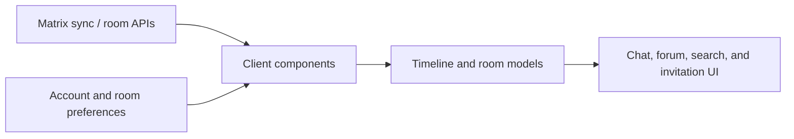

# Room Interaction Workflows

## Status

Stable reference for Matrix room and timeline interactions that sit between the
client component layer and the chat, room, and invitation surfaces.

## Purpose

Use this map when changing polls, threads, forum rooms, room search, read
receipts, typing indicators, or invitations. It identifies the shared
component boundaries without treating these UI affordances as one protocol.

## Scope

In scope:

- timeline polls, replies, and forum-post views
- per-room event search and its result filtering
- read-receipt and typing-indicator settings and display
- incoming invitations, outgoing invitations, and knock approval handling

Not in scope:

- Matrix room settings and power-level rules; see
  `room-settings-and-permissions.md`
- profile and presence data; see `../features/profile-and-presence.md`
- attachment/media processing; see `media-pipeline.md`
- notification delivery for invitations or room activity

## Architecture

The component interfaces keep UI code independent of Matrix SDK details. Matrix
implementations translate Matrix events and room APIs into those interfaces;
non-Matrix clients can provide their own implementations.

## Interaction Boundaries

### Polls

`PollComponent` owns poll recognition, question and answer parsing, response
aggregation, answer submission, and closure. `MatrixPollComponent` currently
uses the Matrix poll event type `org.matrix.msc3381.poll.start`; it preserves
whether answers are disclosed and only permits the poll sender to end an open
poll. Timeline poll views render this component state rather than constructing
poll events directly.

### Threads and forum rooms

`ThreadsComponent` creates a derived thread timeline for a root event and
sends replies through that root. `MatrixThreadTimeline` listens to its parent
timeline so pending sends, edits, redactions, and synced relation changes are
visible while a thread is open. The root remains at the history end of the
newest-first timeline, which keeps the original message pinned at the top of
the thread panel. See `thread-timelines.md` for the ordering contract.

Forum rooms build on that thread model. `ForumRoomComponent` presents thread
roots as `ForumPost` records, with title and tag metadata, author information,
optional media previews, and reply counts. Creating a forum post sends a thread
root; editing tags sends a normal Matrix replacement relation. Tag edits remain
permission-aware: the post author or a user with moderation privileges can edit
them.

### Event search

`EventSearchComponent` creates a room-scoped search session. Matrix search
streams result updates from the room timeline, removes events that the normal
timeline would hide, and returns newest-first results. The current query
filters support `type:`, `from:`, `has:link`, `has:image`, `has:video`, and
`has:file`; remaining words are matched against plaintext event bodies. Search
is a read path and must not alter timeline state or send events.

### Read receipts and typing indicators

`ReadReceiptComponent` exposes receipt updates and a room-level public-receipt
override. `TypingIndicatorComponent` exposes typing members, a room-level
indicator override, and the local typing-status write. Account defaults are
provided by `UserPresenceComponent`; room settings can override those defaults.

The chat UI renders the component streams. Typing text is a live accessibility
region, and its decorative animation is disabled when reduced motion is active.
Treat receipt and typing settings as privacy-sensitive user choices: do not
replace account or room preferences with a hard-coded send policy.

The typing stream fires on every sync that carries `m.typing`, and once more
when the SDK's own `typingIndicatorTimeout` has elapsed. The SDK drops the
ephemeral at that point without notifying anyone, so without the second
emission a missed "stopped typing" update leaves the indicator on screen until
the next typing event in that room.

### Timeline rows and in-place refresh

`MatrixTimeline` mirrors the SDK timeline into the app's row list, but not
one-to-one: the types in `hiddenTimelineEventTypes`
(`matrix_timeline_rows.dart`) never become rows, and history and future page
requests ask the server to omit them. Today that set is exactly the MatrixRTC
membership `org.matrix.msc3401.call.member`, which every call participant
republishes every 25 seconds and which the VoIP component reads from room
state and sync rather than from the timeline. Rows for it were invisible but
still counted, and in a call room they starved history pagination. The set is
closed on purpose: growing it hides events from every chat with nothing on
screen to say so.

The invariant behind the index mapping is that the app's Matrix rows are
exactly the SDK's non-hidden events, in order, interleaved with local-only rows
such as a pending media send. The three mapping functions are pure and
unit-tested; keep them that way rather than reaching into the SDK list from
the widget layer.

Rows refresh two ways. A change of `index` means the row now shows a different
event. A bump of `updateRevision`, threaded from `TimelineViewEntry` through
`TimelineEventViewMessage` to the URL-preview, reactions and poll views, means
the same event was replaced in place - a local echo that synced, a reaction on
an already-reacted message, a poll vote. Every child view that derives state
from its event must react to both. The URL-preview view treats them
differently on purpose: an index change starts over, while a revision bump
neither restarts a request in flight nor re-keys an unchanged preview, because
room updates arrive many times a minute and each one is a revision bump.

For a link-only message, the message row initially keeps the raw link visible
while preview data is loading. When `TimelineEventViewUrlPreviews` resolves a
valid card, it reports that visibility to its parent so the raw link is hidden
inside the same event row. Failed or invalid preview data reports no visible
card and preserves the raw link; the preview card must never become a second
visual message or leave the original message blank.

### Invitations and knocks

`InvitationComponent` maintains the incoming invitation list and provides
accept, reject, outgoing invite, and user-directory-search actions. The Matrix
implementation refreshes from sync, removes locally resolved entries after a
join or leave, and loads profile data for the invite surface.

A previously submitted room knock is retained long enough for an administrator
approval to arrive as an invite. That approval is auto-accepted once; if the
join fails, the invite returns to the normal manual-accept list instead of
retrying every sync. In encrypted rooms, accepting an invitation may then run
the existing history-sharing import flow; an invitation succeeding does not
guarantee old encrypted messages can be decrypted.

## Important Paths

| Area | Primary paths |
| --- | --- |
| Poll contract and Matrix adapter | `intergalactic/lib/client/components/polls/poll_component.dart`, `intergalactic/lib/client/matrix/components/polls/matrix_poll_component.dart` |
| Threads and forum model | `intergalactic/lib/client/components/threads/thread_component.dart`, `intergalactic/lib/client/matrix/components/threads/`, `intergalactic/lib/client/components/forum_room/forum_room_component.dart`, `intergalactic/lib/client/matrix/components/forum_room/` |
| Search | `intergalactic/lib/client/components/event_search/`, `intergalactic/lib/client/matrix/components/event_search/`, `intergalactic/lib/ui/organisms/room_event_search/` |
| Receipts and typing | `intergalactic/lib/client/components/read_receipts/`, `intergalactic/lib/client/components/typing_indicators/`, `intergalactic/lib/client/matrix/components/read_receipts/`, `intergalactic/lib/client/matrix/components/typing_indicators/`, `intergalactic/lib/ui/molecules/typing_indicators_widget.dart` |
| Invitations | `intergalactic/lib/client/components/invitation/`, `intergalactic/lib/client/matrix/components/invitation/`, `intergalactic/lib/ui/organisms/invitation_view/` |
| Timeline rows and refresh | `intergalactic/lib/client/matrix/matrix_timeline.dart`, `intergalactic/lib/client/matrix/matrix_timeline_rows.dart`, `intergalactic/lib/ui/molecules/timeline_events/timeline_view_entry.dart`, `intergalactic/lib/ui/molecules/timeline_events/events/` |

## How To Modify Safely

1. Follow the component contract through its Matrix implementation and the UI
   consumer; do not change only one layer.
2. Preserve newest-first timeline ordering and the pinned-thread-root invariant.
3. Keep search result visibility consistent with ordinary timeline rendering.
4. Preserve account and room privacy preferences for receipts and typing.
5. Treat an accepted invitation, history sharing, and successful decryption as
   distinct outcomes in encrypted rooms.
6. Add focused component and UI coverage when behavior changes; docs-only edits
   should still verify every listed path exists.
7. A timeline child view that derives state from its event must react to both
   `index` and `updateRevision`; a new hidden row type is a recorded decision,
   not a code edit.

## Related Docs

- `thread-timelines.md` for the detailed Matrix thread-timeline contract.
- `room-settings-and-permissions.md` for room settings and permission changes.
- `matrix-e2ee.md` for encrypted-room safety and recovery boundaries.
- `../features/profile-and-presence.md` for profile and presence data.
