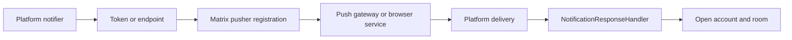

# Push Pipeline

## Status

Stable contributor reference for notification delivery, Matrix pusher
registration, and notification-open routing across platforms.

## Purpose

Use this map when changing notification tokens, Matrix pusher registration,
platform notifier implementations, notification click routing, badge state, or
background notification behavior.

## Scope

In scope:
- push token and endpoint handling
- Matrix pusher registration and refresh rules
- notifier and tap-routing boundaries across Android, iOS, web, and desktop

Not in scope:
- room-specific notification product policy wording
- general background sync unrelated to notification delivery
- release-console or provider-account operator setup

## Standard Terms

- **Notifier**: the platform-specific delivery implementation used by the app.
- **Pusher**: the Matrix-side registration describing where notifications
  should be delivered.
- **Tap routing**: the shared logic that resolves a notification open into the
  correct account and destination.
- **Data-only push**: a delivery model where the platform payload wakes the app
  to fetch or decrypt content locally rather than showing provider-rendered text
  directly.

## Diagram Style

Use left-to-right Mermaid flowcharts with short labels. Call out provider or
transport boundaries only where they change delivery behavior or safety rules.

## Pipeline

## Dependency Map

| Area | Primary paths | Key dependencies |
| --- | --- | --- |
| Notifier selection | `lib/client/components/push_notification/platform_notifier_factory_io.dart` | platform, build flags |
| Shared policy | `lib/client/components/push_notification/notification_manager.dart` | modifiers, content models, sounds |
| Pusher registration | `lib/client/matrix/components/push_notifications/matrix_push_notification_component.dart` | Matrix pushers API, `BuildConfig` |
| Android FCM | `lib/client/components/push_notification/android/firebase_push_notifier.dart` | Firebase, data-only push, background manager |
| Android embedded ntfy | `embedded_ntfy_notifier.dart`, `background_service.dart` | ntfy topic, foreground service |
| iOS | `ios_notifier.dart`, `ios/Runner/AppDelegate.swift` | APNs/local notification bridge |
| Web | `web_push_notifier_html.dart`, `web/` | service worker, browser subscription |
| Desktop | `windows_notifier.dart`, `linux_notifier.dart` | OS notifications, local sound playback |

## Platform Boundaries

- Android FCM builds use Matrix app id `chat.intergalactic.app.android` and a
  configured push gateway host; FCM payloads stay data-only so the app can
  fetch/decrypt locally.
- Android non-Google builds use embedded ntfy with the same Matrix app id and a
  URL pushkey.
- iOS routes APNs and local notification taps through the shared Dart response
  handler.
- Web push must stay behind web-only imports and service-worker routing.
- Desktop notifications may use app-managed sounds and the Windows companion,
  but shared notification policy still decides whether a message is approved.

## Flutter And Native Boundaries

- Flutter/Dart owns shared notification policy, pusher refresh decisions,
  notification content models, and tap-routing/account-resolution logic.
- Native platform runners and service workers own provider registration hooks,
  OS callback entrypoints, and platform delivery permissions.
- Matrix remains the registration and room/account context plane; provider
  transports only deliver wakeups or user-visible notification shells.

## Matrix Pusher Rules

- Register pushers only after the correct Matrix client/account context exists.
- Clean stale legacy Android app ids and wrong transport pushkeys during pusher
  refresh.
- Do not assume the foreground account is the account for a notification tap.
- Preserve Matrix room mute/mention policy before platform-specific display.

## How To Modify Safely

1. Inspect shared notification content/routing and the affected platform
   notifier together.
2. Verify pusher `appId`, `pushkey`, gateway URL, and extra metadata as a set.
3. Keep encrypted notification previews local-decrypt first.
4. Make malformed platform payloads loggable but not user-visible diagnostic
   text.
5. Test click routing through cold launch, warm app, and wrong-active-account
   scenarios when behavior changes.
6. If Android push changes, inspect both FCM and embedded-ntfy paths before
   shipping.

## Related Docs

- `notifications.md` remains the detailed platform notification document.
- `notification-companion-overlay.md` owns the Windows companion overlay.
- `docs/policies/PUSH_PRIVACY_REVIEW.md` owns public privacy posture.
